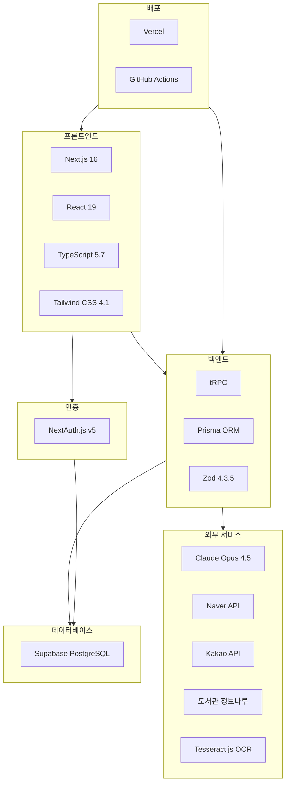

# FactChecker 기술 스택

2026년 1월 최신 안정화 버전 기준

---

## 🎯 기술 선택 기준

1. **최신 안정화 버전**: 2026년 1월 기준 LTS 또는 Stable 버전
2. **Vercel 최적화**: Vercel 배포에 최적화된 기술
3. **타입 안정성**: End-to-End 타입 세이프티
4. **개발자 경험**: 빠른 개발, 좋은 DX
5. **무료/저렴**: 초기 단계에서 비용 최소화

---

## 🏗️ 전체 스택 요약

```
프론트엔드: Next.js 16 + React 19 + TypeScript 5.7 + Tailwind CSS 4.1
백엔드:     Next.js API Routes + tRPC
데이터베이스: Supabase PostgreSQL + Prisma ORM
인증:       NextAuth.js v5
AI:         Anthropic Claude Opus 4.5
배포:       Vercel
```

---

## 📦 주요 기술 상세

### 프론트엔드

| 기술 | 버전 | 용도 | 선택 이유 |
|------|------|------|-----------|
| **Next.js** | 16.1.4 | React 프레임워크 | Vercel 최적화, App Router, SSR/SSG |
| **React** | 19.2.1 | UI 라이브러리 | Actions, useOptimistic, 성능 개선 |
| **TypeScript** | 5.7 | 타입 안정성 | 최신 기능, 런타임 에러 방지 |
| **Tailwind CSS** | 4.1.18 | CSS 프레임워크 | v4의 5배 빠른 빌드, 유틸리티 클래스 |
| **TanStack Query** | v5 | 서버 상태 관리 | 캐싱, 리페칭, tRPC 통합 |

### 백엔드

| 기술 | 버전 | 용도 | 선택 이유 |
|------|------|------|-----------|
| **tRPC** | 최신 | API 레이어 | End-to-End 타입 세이프티, 낮은 보일러플레이트 |
| **Prisma** | 6.2+ | ORM | PostgreSQL 최적화, 타입 생성, 마이그레이션 |
| **Zod** | 4.3.5 | 스키마 검증 | 런타임 검증, TypeScript 통합 |
| **NextAuth.js** | v5 beta | 인증 | 오픈소스, 무료, 한국 OAuth 지원 |

### 데이터베이스

| 기술 | 용도 | 선택 이유 |
|------|------|-----------|
| **Supabase PostgreSQL** | 관계형 DB | Vercel 최적 호환, 관리형, ACID 준수, 무료 티어 |
| **Row Level Security** | 보안 | 데이터 접근 제어 |
| **PgBouncer** | 커넥션 풀링 | 성능 최적화 |

### AI 및 머신러닝

| 기술 | 모델 | 용도 | 선택 이유 |
|------|------|------|-----------|
| **Anthropic Claude** | Opus 4.5 | 팩트체크 분석 | Extended thinking mode, 다단계 추론 |
| **Tesseract.js** | 7.0.0 | OCR | 순수 JS, 100+ 언어, 무료 |

### 외부 API

| API | 용도 | 비용 | 상태 |
|-----|------|------|------|
| **Naver Developers** | 학술정보, 책, 뉴스 검색 | 무료 (25,000 req/day) | ✅ 보유 |
| **도서관 정보나루** | 국립중앙도서관 소장 자료 | 무료 | ✅ 보유 |
| **Kakao Local** | 도서관 위치, 지도 | 무료 (300,000 req/day) | ✅ 보유 |
| **알라딘** | 도서 상세, 표지 | 무료 | 🔄 발급 필요 (5분) |
| **Google Scholar** | 학술논문 (크롤링) | 무료 | ✅ 사용 가능 |
| **PubMed** | 의학 논문 (크롤링) | 무료 | ✅ 사용 가능 |

### 배포 및 인프라

| 기술 | 용도 | 비용 |
|------|------|------|
| **Vercel** | 프로덕션 배포 | 무료 (Hobby tier) |
| **GitHub Actions** | CI/CD | 무료 (2000분/월) |
| **Vercel Analytics** | 성능 모니터링 | 무료 (Pro 이상에서 고급 기능) |

---

## 🔄 대안 기술 및 선택 근거

### tRPC vs REST vs GraphQL

**선택: tRPC**

| 기준 | tRPC | REST | GraphQL |
|------|------|------|---------|
| 타입 안정성 | ⭐⭐⭐⭐⭐ | ⭐ | ⭐⭐⭐ |
| 보일러플레이트 | ⭐⭐⭐⭐⭐ | ⭐⭐ | ⭐⭐⭐ |
| Next.js 통합 | ⭐⭐⭐⭐⭐ | ⭐⭐⭐⭐ | ⭐⭐⭐ |
| 학습 곡선 | ⭐⭐⭐⭐ | ⭐⭐⭐⭐⭐ | ⭐⭐ |

**결론**: TypeScript 전용 프로젝트에서 tRPC가 최적

### PostgreSQL vs MongoDB

**선택: PostgreSQL**

| 기준 | PostgreSQL | MongoDB |
|------|-----------|---------|
| 데이터 무결성 | ⭐⭐⭐⭐⭐ (ACID) | ⭐⭐⭐ |
| 관계 표현 | ⭐⭐⭐⭐⭐ (JOIN) | ⭐⭐ |
| 복잡한 쿼리 | ⭐⭐⭐⭐⭐ | ⭐⭐⭐ |
| 확장성 | ⭐⭐⭐⭐ | ⭐⭐⭐⭐⭐ |

**결론**: 팩트체크는 데이터 정확성이 최우선, PostgreSQL 필수

### NextAuth vs Clerk

**선택: NextAuth.js**

| 기준 | NextAuth.js | Clerk |
|------|-------------|-------|
| 비용 | ⭐⭐⭐⭐⭐ (무료) | ⭐⭐ (유료) |
| 커스터마이징 | ⭐⭐⭐⭐⭐ | ⭐⭐⭐ |
| 한국 OAuth | ⭐⭐⭐⭐⭐ | ⭐⭐ |
| 설정 시간 | ⭐⭐⭐ (30분) | ⭐⭐⭐⭐⭐ (7분) |

**결론**: 무료이면서 한국 OAuth 통합 용이, NextAuth 선택

### Claude vs GPT-4

**선택: Anthropic Claude Opus 4.5**

| 기준 | Claude Opus 4.5 | GPT-4 |
|------|-----------------|-------|
| 팩트체크 정확도 | ⭐⭐⭐⭐⭐ | ⭐⭐⭐⭐⭐ |
| 다단계 추론 | ⭐⭐⭐⭐⭐ | ⭐⭐⭐⭐ |
| Extended thinking | ⭐⭐⭐⭐⭐ | ⭐⭐⭐ |
| 비용 | ⭐⭐⭐ | ⭐⭐⭐ |

**결론**: Extended thinking mode가 체계적 팩트체크에 유리

---

## 📊 기술 스택 다이어그램



---

## 📋 의존성 목록

### 핵심 의존성 (dependencies)

```json
{
  "@anthropic-ai/sdk": "^0.34.0",
  "@auth/prisma-adapter": "^2.7.4",
  "@prisma/client": "^6.2.0",
  "@tanstack/react-query": "^5.62.8",
  "@trpc/client": "^11.0.0",
  "@trpc/next": "^11.0.0",
  "@trpc/react-query": "^11.0.0",
  "@trpc/server": "^11.0.0",
  "bcryptjs": "^2.4.3",
  "next": "16.1.4",
  "next-auth": "^5.0.0-beta.25",
  "react": "19.0.0",
  "react-dom": "19.0.0",
  "superjson": "^2.2.2",
  "tesseract.js": "^5.1.1",
  "zod": "^4.3.5"
}
```

### 개발 의존성 (devDependencies)

```json
{
  "@types/bcryptjs": "^2.4.6",
  "@types/node": "^22.10.5",
  "@types/react": "^19.0.6",
  "@types/react-dom": "^19.0.2",
  "autoprefixer": "^10.4.20",
  "eslint": "^9.18.0",
  "eslint-config-next": "16.1.4",
  "postcss": "^8.4.49",
  "prettier": "^3.4.2",
  "prettier-plugin-tailwindcss": "^0.6.9",
  "prisma": "^6.2.0",
  "tailwindcss": "^4.1.18",
  "tsx": "^4.19.2",
  "typescript": "^5.7.2"
}
```

---

## 🌟 주요 기능별 기술

### 1. 팩트체크 분석
- **Claude Opus 4.5**: AI 기반 신뢰도 분석
- **Zod**: 입력 검증
- **tRPC**: 타입 세이프 API

### 2. 참고자료 수집
- **Naver API**: 국내 학술정보, 책, 뉴스
- **도서관 정보나루**: 국립중앙도서관 소장 자료
- **알라딘 API**: 도서 상세 정보
- **Google Scholar**: 글로벌 학술논문 (크롤링)

### 3. 도서관 연계
- **Kakao Maps API**: 지도 표시, 위치 검색
- **Geolocation API**: 사용자 위치
- **PostgreSQL**: 도서관-도서 관계 저장

### 4. 이미지 처리
- **Tesseract.js**: OCR (이미지→텍스트)
- **Next.js Image**: 이미지 최적화

### 5. 사용자 인증
- **NextAuth.js**: OAuth + 이메일 인증
- **bcryptjs**: 비밀번호 해싱

---

## 🔧 개발 도구

### 필수 도구

1. **VSCode** (권장 IDE)
   - 확장: ESLint, Prettier, Tailwind CSS IntelliSense, Prisma

2. **Prisma Studio**
   ```bash
   npx prisma studio
   ```
   - 데이터베이스 GUI
   - 데이터 확인 및 수정

3. **React DevTools**
   - 크롬 확장
   - 컴포넌트 디버깅

### 선택적 도구

1. **Postman** 또는 **Insomnia**
   - API 테스트

2. **Sentry**
   - 에러 트래킹 (프로덕션)

3. **Vercel Analytics**
   - 성능 모니터링

---

## 📈 성능 특성

### 빌드 시간
- **Tailwind CSS v4**: v3 대비 5배 빠른 빌드
- **Next.js 16**: 증분 빌드 최적화

### 런타임 성능
- **React 19**: 서버 컴포넌트로 번들 크기 감소
- **tRPC**: REST 대비 적은 네트워크 오버헤드
- **Prisma**: 최적화된 SQL 쿼리

### 초기 로딩
- **Next.js SSR**: 빠른 First Contentful Paint
- **Image Optimization**: WebP/AVIF 자동 변환
- **Code Splitting**: 동적 import로 번들 크기 최소화

---

## 💰 비용 예상 (월간)

### 무료 티어로 시작 가능

| 서비스 | 무료 티어 | 예상 비용 |
|--------|-----------|-----------|
| **Vercel** | 100GB 대역폭, 100 빌드/월 | $0 (Hobby) |
| **Supabase** | 500MB DB, 2GB 전송 | $0 (Free) |
| **Anthropic Claude** | Pay-as-you-go | ~$10-50 (사용량 기반) |
| **Naver API** | 25,000 req/day | $0 |
| **Kakao API** | 300,000 req/day | $0 |
| **도서관 정보나루** | 무제한 | $0 |

**총 예상 비용**: $10-50/월 (AI API만 유료)

### 확장 시 비용 (1000 사용자 기준)

| 서비스 | 월 비용 | 비고 |
|--------|---------|------|
| **Vercel Pro** | $20 | 더 많은 대역폭 필요 시 |
| **Supabase Pro** | $25 | 8GB DB, 50GB 전송 |
| **Anthropic Claude** | $100-200 | API 사용량에 따라 |

**총 예상 비용**: $145-245/월

---

## 🔄 기술 업데이트 전략

### 장기 지원 (LTS)

- **Node.js**: 20 LTS (2026년 4월까지)
- **Next.js**: 주요 버전 1년 지원
- **React**: 장기 안정화

### 마이너 업데이트

- **월 1회**: 패치 버전 업데이트
- **분기 1회**: 마이너 버전 검토

### 메이저 업데이트

- **연 1-2회**: 주요 버전 업그레이드 검토
- 충분한 테스트 후 적용

---

## 📚 학습 경로

### 초보자 (개발 경험 없음)

1. **JavaScript 기초** (2주)
   - 변수, 함수, 배열, 객체
   - 비동기 프로그래밍 (Promise, async/await)

2. **React 기초** (2주)
   - 컴포넌트, Props, State
   - Hooks (useState, useEffect)

3. **Next.js 기초** (1주)
   - App Router
   - 페이지 생성
   - API Routes

4. **TypeScript 기초** (1주)
   - 타입, 인터페이스
   - 제네릭

### 중급자 (웹 개발 경험 있음)

1. **Next.js 16 App Router** (1주)
   - 서버/클라이언트 컴포넌트
   - 라우팅
   - 데이터 페칭

2. **tRPC** (3일)
   - 프로시저 생성
   - React 훅 사용

3. **Prisma** (3일)
   - 스키마 정의
   - 쿼리 작성
   - 마이그레이션

### 고급 (팀 리드)

1. **아키텍처 설계** (읽기)
   - [code-architecture.md](code-architecture.md)

2. **배포 전략** (1일)
   - Vercel 설정
   - 환경 변수 관리

3. **성능 최적화** (지속적)
   - 캐싱 전략
   - 쿼리 최적화

---

## 🎓 권장 학습 자료

### 공식 문서
- [Next.js 공식 문서](https://nextjs.org/docs)
- [React 공식 문서](https://react.dev/)
- [tRPC 공식 문서](https://trpc.io/docs)
- [Prisma 공식 문서](https://www.prisma.io/docs)

### 한국어 자료
- [Next.js 한국어 문서](https://nextjs.org/docs)
- [벨로퍼트 모던 리액트](https://react.vlpt.us/)
- [타입스크립트 핸드북](https://typescript-kr.github.io/)

### 영상 강의
- [Next.js 14/15 Full Course](https://www.youtube.com/results?search_query=nextjs+full+course)
- [tRPC Full Tutorial](https://www.youtube.com/results?search_query=trpc+tutorial)

---

## ✅ 개발 환경 체크리스트

설정이 완료되었는지 확인하세요:

### 기본 설정
- [ ] Node.js 20+ 설치됨
- [ ] npm 10+ 설치됨
- [ ] Git 설치됨
- [ ] VSCode 설치됨 (권장)

### 프로젝트 설정
- [ ] 저장소 클론 완료
- [ ] `npm install` 완료
- [ ] `.env` 파일 생성
- [ ] 환경 변수 입력 완료

### 데이터베이스
- [ ] Supabase 계정 생성
- [ ] 프로젝트 생성
- [ ] Connection String 복사
- [ ] `npx prisma db push` 성공

### API 키
- [ ] Anthropic API 키 발급
- [ ] Naver API 확인 (이미 보유)
- [ ] Kakao API 확인 (이미 보유)
- [ ] 도서관 정보나루 확인 (이미 보유)
- [ ] 알라딘 TTB Key 발급 (선택)

### 실행 테스트
- [ ] `npm run dev` 성공
- [ ] http://localhost:3000 접속 가능
- [ ] 콘솔에 에러 없음

---

## 🆘 도움이 필요하신가요?

### 일반적인 문제
- [문제 해결 가이드](GETTING-STARTED.md#🐛-문제-해결)

### 환경 변수 설정
- [환경 변수 상세 가이드](ENV-SETUP.md)

### 기술 구조 이해
- [코드 아키텍처](code-architecture.md)

---

**문서 버전**: 1.0  
**작성일**: 2026년 1월 23일
