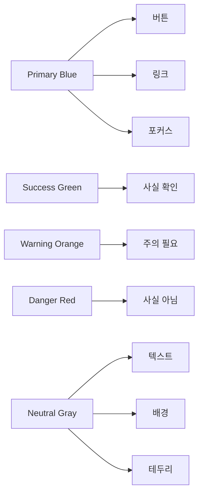

# FactChecker 디자인 가이드

FactChecker 팩트체크 서비스의 종합 디자인 시스템

---

## 목차

1. [소개](#소개)
2. [브랜딩](#브랜딩)
3. [색상 시스템](#색상-시스템)
4. [타이포그래피](#타이포그래피)
5. [간격 시스템](#간격-시스템)
6. [UI 컴포넌트](#ui-컴포넌트)
7. [아이콘](#아이콘)
8. [그림자 & 깊이](#그림자--깊이)
9. [모서리](#모서리)
10. [레이아웃](#레이아웃)
11. [모션 & 애니메이션](#모션--애니메이션)
12. [이미지 & 일러스트레이션](#이미지--일러스트레이션)
13. [톤 앤 보이스](#톤--보이스)
14. [접근성](#접근성)
15. [다크 모드](#다크-모드)
16. [개발자 가이드](#개발자-가이드)

---

## 소개

### FactChecker 디자인 철학

FactChecker는 가짜뉴스와 허위정보를 학술자료 기반으로 검증하는 팩트체크 서비스입니다. 우리의 디자인은 **단순함, 접근성, 신뢰성, 친근함**이라는 네 가지 핵심 가치를 중심으로 구축됩니다.

### 핵심 가치

**단순함 (Simplicity)**
- 복잡하지 않고 직관적인 인터페이스
- 불필요한 요소 제거
- 명확한 정보 계층 구조

**접근성 (Accessibility)**
- 모든 연령대가 쉽게 사용 가능
- 시니어부터 1020세대까지
- WCAG 2.1 AA 준수

**신뢰성 (Trustworthy)**
- 팩트체크 서비스에 걸맞은 전문성
- 명확하고 정확한 정보 전달
- 일관성 있는 디자인

**친근함 (Friendly)**
- 딱딱하지 않은 부드러운 느낌
- 격려하고 긍정적인 톤
- 접근하기 쉬운 분위기

### 디자인 방향

```
미니멀하면서도 차갑지 않음
┌────────────────────────────────────┐
│  충분한 여백                        │
│  깔끔한 레이아웃                    │
│  부드러운 모서리                    │
│  은은한 그림자                      │
└────────────────────────────────────┘

구식이 아닌 현대적인 느낌
┌────────────────────────────────────┐
│  최신 디자인 트렌드                 │
│  세련된 타이포그래피                │
│  효과적인 시각적 계층               │
└────────────────────────────────────┘
```

### 타겟 사용자

- **일반 대중**: 모든 연령대
- **1020세대**: 유튜브·SNS 정보 검증
- **직장인**: 건강·육아·생활 정보
- **학생·연구자**: 과제·논문 자료
- **시니어**: 메신저 허위정보

---

## 브랜딩

### 로고 & 아이덴티티

**서비스 이름**
```
FactChecker
팩트체커
```

**로고 콘셉트**
- 돋보기 🔍 + 체크마크 ✓ 조합
- 정보를 "검색하고 확인"한다는 의미
- 단순하고 기억하기 쉬운 형태

**태그라인**
```
"사실을 확인하고, 도서관과 연결하다"
```

**브랜드 성격**

| 특성 | 설명 |
|------|------|
| 신뢰할 수 있는 | 정확한 정보, 학술 자료 기반 |
| 접근하기 쉬운 | 누구나 쉽게 사용 가능 |
| 지적인 | 도서관 연계, 교육적 가치 |
| 친근한 | 부드럽고 편안한 분위기 |

### 로고 사용 가이드

**최소 크기**
```
디지털:  32px 높이
인쇄물:  10mm 높이
```

**여백 (Clear Space)**
```
최소 여백: 로고 높이의 1/4
┌─────────────────────┐
│                     │
│   FactChecker       │
│                     │
└─────────────────────┘
```

**색상 변형**

1. **Primary Version** (기본)
   - 배경: White
   - 로고: Primary-500 (#3B82F6)

2. **Light Version** (밝은 배경용)
   - 배경: White or Gray-50
   - 로고: Primary-600 (#2563EB)

3. **Dark Version** (어두운 배경용)
   - 배경: Gray-900
   - 로고: White

4. **Monochrome Version** (단색)
   - 로고: Gray-900 (검은색)
   - 로고: White (흰색)

**금지 사항**

```
❌ 로고 왜곡 (늘리기, 찌그러뜨리기)
❌ 로고 회전
❌ 승인되지 않은 색상 사용
❌ 그림자나 효과 추가
❌ 여백 침범
❌ 다른 요소와 혼합
```

---

## 색상 시스템

### Primary Color (연한 파란색)

FactChecker의 메인 컬러는 **연한 파란색**입니다. 신뢰감과 전문성을 나타내면서도 친근하고 접근하기 쉬운 느낌을 줍니다.

```
Primary-50   #EFF6FF  ████  가장 연한 배경
Primary-100  #DBEAFE  ████  연한 배경
Primary-200  #BFDBFE  ████  매우 연한
Primary-300  #93C5FD  ████  연한 (호버 상태)
Primary-400  #60A5FA  ████  중간
Primary-500  #3B82F6  ████  메인 (버튼, 링크) ⭐
Primary-600  #2563EB  ████  진한 (활성 상태)
Primary-700  #1D4ED8  ████  매우 진한
Primary-800  #1E40AF  ████  텍스트
Primary-900  #1E3A8A  ████  가장 진한
```

**사용 예시**
- Primary-500: 주요 버튼, 링크, 포커스 상태
- Primary-50/100: 배경, 호버 상태
- Primary-600: 버튼 활성/눌림 상태
- Primary-800: 강조 텍스트

### Semantic Colors (의미 색상)

정보의 신뢰도와 상태를 나타내는 색상입니다.

```
Success (사실로 확인됨)
#10B981  ████  부드러운 초록색
#D1FAE5  ████  연한 배경

Warning (주의가 필요함)
#F59E0B  ████  따뜻한 오렌지색
#FEF3C7  ████  연한 배경

Danger (사실이 아님)
#EF4444  ████  부드러운 빨간색
#FEE2E2  ████  연한 배경

Info (정보)
#3B82F6  ████  Primary-500와 동일
#DBEAFE  ████  연한 배경
```

**신뢰도 점수 색상 매핑**
```
80-100점  Success  사실로 확인됨
60-79점   Info     대체로 사실임
40-59점   Warning  주의가 필요함
20-39점   Warning  근거 부족
0-19점    Danger   사실이 아님
```

### Neutral Colors (중립 색상)

회색 계열로 배경, 텍스트, 테두리 등에 사용됩니다.

```
Gray-50   #F9FAFB  ████  페이지 배경
Gray-100  #F3F4F6  ████  카드 배경
Gray-200  #E5E7EB  ████  테두리, 구분선
Gray-300  #D1D5DB  ████  비활성화 요소
Gray-400  #9CA3AF  ████  플레이스홀더
Gray-500  #6B7280  ████  보조 텍스트
Gray-600  #4B5563  ████  일반 텍스트
Gray-700  #374151  ████  강조 텍스트
Gray-800  #1F2937  ████  제목
Gray-900  #111827  ████  헤딩, 중요 텍스트
```

### 색상 사용 원칙

**텍스트 색상**
```
제목 (Heading):    Gray-900
본문 (Body):       Gray-600
보조 (Secondary):  Gray-500
비활성 (Disabled): Gray-400
```

**배경 색상**
```
페이지:       White (#FFFFFF)
섹션:         Gray-50 (#F9FAFB)
카드:         White (#FFFFFF)
입력 필드:    White → Primary-50 (포커스 시)
```

**액션 색상**
```
Primary Action:    Primary-500
Secondary Action:  White + Primary-500 테두리
Destructive:       Danger
```

**색상 대비율**
- 일반 텍스트 (16px 미만): 최소 4.5:1
- 큰 텍스트 (18px 이상): 최소 3:1
- UI 요소: 최소 3:1

**색상 팔레트 다이어그램**



---

## 타이포그래피

### Font Family (글꼴)

**한글 폰트**
```css
font-family: 'Pretendard Variable', 'Pretendard', 
             -apple-system, BlinkMacSystemFont, 
             system-ui, 'Segoe UI', 'Malgun Gothic', 
             sans-serif;
```

Pretendard는 한글과 영문 모두 아름다운 가변 폰트입니다.
- 다운로드: https://cactus.tistory.com/306
- CDN: https://cdn.jsdelivr.net/gh/orioncactus/pretendard/dist/web/

**영문 폰트**
```css
font-family: 'Inter', -apple-system, BlinkMacSystemFont, 
             system-ui, 'Segoe UI', sans-serif;
```

Inter는 가독성이 뛰어난 현대적인 영문 폰트입니다.
- 다운로드: https://rsms.me/inter/
- Google Fonts: https://fonts.google.com/specimen/Inter

**숫자/코드 폰트**
```css
font-family: 'JetBrains Mono', 'Roboto Mono', 
             'Courier New', monospace;
```

점수 표시나 코드에 사용됩니다.

### Type Scale (글자 크기)

```
Display   48px / 3rem      페이지 대형 제목 (랜딩)
H1        32px / 2rem      페이지 제목
H2        24px / 1.5rem    섹션 제목
H3        20px / 1.25rem   서브 섹션
H4        18px / 1.125rem  카드 제목
Body      16px / 1rem      본문 텍스트
Small     14px / 0.875rem  보조 텍스트, 캡션
Caption   12px / 0.75rem   라벨, 작은 텍스트
```

**시각적 계층**

```
Display (48px)
━━━━━━━━━━━━━━━━━━━━━━━━━━━━━━━━

H1 (32px)
━━━━━━━━━━━━━━━━━━━━━━

H2 (24px)
━━━━━━━━━━━━━━━

H3 (20px)
━━━━━━━━━━━━

H4 (18px)
━━━━━━━━━━

Body (16px)
━━━━━━━━

Small (14px)
━━━━━━

Caption (12px)
━━━━
```

### Font Weight (글자 굵기)

```
Regular   400   본문, 일반 텍스트
Medium    500   강조, 버튼 텍스트
SemiBold  600   제목, 중요 정보
Bold      700   대제목, 매우 중요한 텍스트
```

**사용 예시**
```
제목 (H1-H4):      SemiBold (600) 이상
본문 (Body):       Regular (400)
강조 (Emphasis):   Medium (500)
버튼 (Button):     Medium (500)
레이블 (Label):    Medium (500)
```

### Line Height (행간)

```
Tight   1.25    제목, 헤딩 (공간 효율)
Normal  1.5     본문, 일반 텍스트 (가독성)
Loose   1.75    긴 문단, 설명 (편안함)
```

**사용 원칙**
- 제목: Tight (1.25)
- 본문: Normal (1.5)
- 긴 글, 설명: Loose (1.75)

### Letter Spacing (자간)

```
Tight   -0.02em  대형 제목 (Display)
Normal  0        일반 텍스트
Wide    0.05em   소문자 많은 영문, 레이블
```

### 타이포그래피 예시

**페이지 제목**
```
font-size: 32px (2rem)
font-weight: 600 (SemiBold)
line-height: 1.25
color: Gray-900
```

**본문**
```
font-size: 16px (1rem)
font-weight: 400 (Regular)
line-height: 1.5
color: Gray-600
```

**버튼**
```
font-size: 16px (1rem)
font-weight: 500 (Medium)
line-height: 1.5
color: White (Primary) / Primary-600 (Secondary)
```

---

## 간격 시스템

일관된 8px 기반 그리드 시스템을 사용합니다.

### Spacing Scale

```
xs    4px   0.25rem   아이콘 내부 여백
sm    8px   0.5rem    버튼 내부 여백 (작은)
md    12px  0.75rem   컴포넌트 내부 여백
base  16px  1rem      기본 여백 ⭐
lg    24px  1.5rem    섹션 간 여백
xl    32px  2rem      큰 섹션 여백
2xl   48px  3rem      페이지 섹션 구분
3xl   64px  4rem      메인 섹션 구분
4xl   96px  6rem      페이지 상하단 여백
```

### 여백 원칙

**관련 요소는 가깝게**
```
┌──────────────────┐
│ 제목              │ ← 8px
│ 부제목            │ ← 16px
│ 본문 단락         │
└──────────────────┘
```

**그룹은 멀게**
```
┌──────────────────┐
│ 그룹 A           │
│                  │
└──────────────────┘
       ↕ 32px
┌──────────────────┐
│ 그룹 B           │
│                  │
└──────────────────┘
```

**충분한 여백으로 미니멀한 느낌**
```
┌─────────────────────────────────┐
│                                 │ ← 상단 64px
│    제목                         │
│                                 │ ← 24px
│    본문 내용...                 │
│                                 │ ← 하단 64px
└─────────────────────────────────┘
```

### 컴포넌트별 여백 가이드

**버튼**
```
패딩 (좌우): 24px
패딩 (상하): 12px (총 높이 40px)
```

**카드**
```
내부 패딩: 24px
외부 여백: 16px
```

**입력 필드**
```
내부 패딩: 12px 16px
외부 여백: 16px
```

**섹션**
```
상하 여백: 64px
내부 콘텐츠 간격: 32px
```

---

## UI 컴포넌트

### 버튼 (Button)

**Primary Button (주 버튼)**

```
┌─────────────────────┐
│   팩트체크 시작      │  ← Primary-500 배경
└─────────────────────┘     White 텍스트
                            Medium (500) 폰트

속성:
- 배경: Primary-500 (#3B82F6)
- 텍스트: White
- 높이: 40px (데스크톱), 44px (모바일)
- 패딩: 12px 24px
- 모서리: 8px
- 그림자: 0 1px 2px rgba(0,0,0,0.05)
- 폰트: 16px, Medium (500)

상태:
- Hover: Primary-600 배경, 살짝 위로 이동
- Active: Primary-700 배경
- Disabled: Gray-300 배경, Gray-500 텍스트
- Focus: Primary-500 테두리 (2px)
```

**Secondary Button (보조 버튼)**

```
┌─────────────────────┐
│   더 알아보기        │  ← White 배경
└─────────────────────┘     Primary-500 테두리
                            Primary-600 텍스트

속성:
- 배경: White
- 테두리: Primary-500, 1px
- 텍스트: Primary-600
- 높이: 40px
- 패딩: 12px 24px
- 모서리: 8px

상태:
- Hover: Primary-50 배경
- Active: Primary-100 배경
- Focus: Primary-500 테두리 (2px)
```

**Text Button (텍스트 버튼)**

```
더 알아보기 →

속성:
- 텍스트: Primary-600
- 밑줄: 없음
- 폰트: 16px, Medium (500)

상태:
- Hover: 밑줄 추가
- Active: Primary-700
```

**Icon Button (아이콘 버튼)**

```
┌───┐
│ × │  ← 32px × 32px
└───┘

속성:
- 크기: 32px × 32px
- 아이콘: 20px, Gray-600
- 배경: 투명
- 모서리: 6px

상태:
- Hover: Gray-100 배경
- Active: Gray-200 배경
```

**버튼 크기 변형**

```
Large:   높이 48px, 패딩 16px 32px, 폰트 18px
Default: 높이 40px, 패딩 12px 24px, 폰트 16px
Small:   높이 32px, 패딩 8px 16px,  폰트 14px
```

### 입력 필드 (Input Field)

**Text Input**

```
┌─────────────────────────────┐
│ 검증할 정보를 입력하세요...  │
└─────────────────────────────┘

속성:
- 높이: 40px (데스크톱), 44px (모바일)
- 패딩: 12px 16px
- 테두리: Gray-300, 1px
- 모서리: 8px
- 배경: White
- 폰트: 16px, Regular (400)
- 플레이스홀더: Gray-400

상태:
- Focus: Primary-500 테두리 (2px), Primary-50 배경
- Error: Danger 테두리, Danger-50 배경
- Disabled: Gray-100 배경, Gray-400 텍스트
```

**Textarea**

```
┌─────────────────────────────┐
│                             │
│ 여러 줄 텍스트 입력...       │
│                             │
│                             │
└─────────────────────────────┘

속성:
- 최소 높이: 120px
- 패딩: 12px 16px
- 크기 조절: vertical (세로만)
- 기타: Text Input과 동일
```

**Select Dropdown**

```
┌──────────────────────┬───┐
│ 선택하세요...         │ ▼ │
└──────────────────────┴───┘

속성:
- Input과 동일
- 아이콘: 우측 12px, Gray-600
```

### 카드 (Card)

```
┌────────────────────────────┐
│                            │
│  제목                      │
│                            │
│  본문 내용...              │
│                            │
│  [버튼]                    │
│                            │
└────────────────────────────┘

속성:
- 배경: White
- 테두리: Gray-200, 1px
- 모서리: 12px
- 그림자: 0 1px 2px rgba(0,0,0,0.05)
- 패딩: 24px

상태:
- Hover: 그림자 증가, 살짝 위로 이동
  shadow: 0 4px 6px rgba(0,0,0,0.1)
  transform: translateY(-2px)
```

**카드 변형**

```
Outlined Card:
- 테두리 강조 (2px)
- 그림자 없음

Elevated Card:
- 테두리 없음
- 그림자만 (기본보다 강함)

Flat Card:
- 테두리 없음
- 그림자 없음
- 배경만으로 구분
```

### 모달 (Modal)

```
┌─────────────────────────────────┐
│ ╔═══════════════════════════╗   │
│ ║  제목                 ×   ║   │
│ ║                           ║   │
│ ║  모달 내용...              ║   │
│ ║                           ║   │
│ ║  [취소]  [확인]           ║   │
│ ╚═══════════════════════════╝   │
└─────────────────────────────────┘
    ← 오버레이 (반투명)

속성:
- 배경: White
- 오버레이: rgba(0, 0, 0, 0.5)
- 모서리: 16px
- 그림자: 0 20px 25px rgba(0,0,0,0.1)
- 최대 너비: 600px
- 패딩: 32px

애니메이션:
- 진입: fade-in (300ms) + scale (0.95 → 1)
- 종료: fade-out (200ms) + scale (1 → 0.95)
```

### 뱃지 (Badge)

```
┌────────┐
│ NEW    │  ← 작은 라벨
└────────┘

속성:
- 높이: 24px
- 패딩: 4px 8px
- 모서리: 4px (Small)
- 폰트: 12px, Medium (500)

색상 변형:
- Primary: Primary-500 배경, White 텍스트
- Success: Success 배경, White 텍스트
- Warning: Warning 배경, White 텍스트
- Neutral: Gray-200 배경, Gray-700 텍스트
```

### 탭 (Tabs)

```
[ 학술논문 ]  [ 도서 ]  [ 뉴스 ]
  ━━━━━━━      ────      ────
     ↑
   활성 탭

속성:
- 높이: 40px
- 패딩: 8px 16px
- 폰트: 16px, Medium (500)

상태:
- Active: Primary-500 텍스트, 하단 2px 테두리
- Inactive: Gray-600 텍스트
- Hover: Primary-300 텍스트
```

### 토글 스위치 (Toggle Switch)

```
OFF:  ○──────   Gray-300
ON:   ──────○   Primary-500

속성:
- 너비: 44px
- 높이: 24px
- 원: 20px
- 모서리: 9999px (Full)
```

### 체크박스 & 라디오

```
Checkbox:  ☑  체크됨
          ☐  미체크

Radio:     ◉  선택됨
          ○  미선택

속성:
- 크기: 20px × 20px
- 테두리: Gray-300, 2px
- 체크/선택: Primary-500
```

### 알림 (Toast/Alert)

```
┌──────────────────────────────┐
│ ✓ 검증이 완료되었습니다!      │
└──────────────────────────────┘

속성:
- 최소 너비: 320px
- 최대 너비: 480px
- 패딩: 16px
- 모서리: 8px
- 그림자: 0 4px 6px rgba(0,0,0,0.1)
- 위치: 우측 상단

색상 변형:
- Success: Success 배경 (연한), Success 아이콘
- Warning: Warning 배경 (연한), Warning 아이콘
- Error: Danger 배경 (연한), Danger 아이콘
- Info: Primary 배경 (연한), Primary 아이콘
```

---

## 아이콘

### 아이콘 스타일

**기본 원칙**
- 스타일: Rounded (부드러운 모서리)
- 선 굵기: 2px (일관성)
- 형태: 단순하고 명확한

**추천 아이콘 라이브러리**

1. **Heroicons** (추천)
   - https://heroicons.com/
   - Tailwind CSS 제작팀
   - Outline / Solid 두 가지 스타일

2. **Lucide Icons**
   - https://lucide.dev/
   - Feather Icons 후속작
   - 깔끔하고 현대적

3. **Phosphor Icons**
   - https://phosphoricons.com/
   - 다양한 스타일 옵션

### 아이콘 크기

```
Small:   16px  작은 버튼, 인라인 텍스트
Default: 20px  일반 UI 요소
Medium:  24px  버튼, 탭
Large:   32px  큰 버튼, 특별한 아이콘
XLarge:  48px  일러스트레이션
```

**사용 예시**
```
텍스트 옆:    16px-20px
버튼:         20px-24px
네비게이션:   24px
대형 UI:      32px-48px
```

### 아이콘 색상

```
기본:       Gray-600
활성:       Primary-500
비활성:     Gray-400
위험:       Danger
성공:       Success
```

### 자주 사용하는 아이콘

**일반**
```
검색:        🔍 MagnifyingGlass
닫기:        × XMark
메뉴:        ☰ Bars3
홈:          🏠 Home
설정:        ⚙ Cog
사용자:      👤 User
```

**액션**
```
추가:        ➕ Plus
삭제:        🗑 Trash
편집:        ✏ Pencil
저장:        💾 FolderArrowDown
공유:        🔗 Share
새로고침:    ↻ ArrowPath
```

**상태**
```
체크:        ✓ Check
경고:        ⚠ ExclamationTriangle
정보:        ℹ InformationCircle
오류:        ⊗ XCircle
성공:        ✓ CheckCircle
```

**팩트체크 관련**
```
신뢰도:      📊 ChartBar
논문:        📄 Document
도서:        📚 BookOpen
뉴스:        📰 Newspaper
도서관:      🏛 BuildingLibrary
위치:        📍 MapPin
```

### 아이콘 사용 원칙

1. **의미가 명확한 아이콘만 사용**
   - 보편적으로 이해 가능
   - 문화권 고려

2. **텍스트 레이블과 함께 사용**
   - 아이콘만 사용 금지 (특수한 경우 제외)
   - 접근성 향상

3. **일관된 스타일 유지**
   - 한 가지 아이콘 라이브러리 사용
   - 혼용 금지

4. **적절한 크기와 여백**
   - 텍스트와 조화
   - 클릭 가능한 영역 확보 (최소 44px)

---

## 그림자 & 깊이

부드러운 그림자로 깊이감을 표현하여 UI 요소의 계층을 구분합니다.

### Elevation Level

```
Level 0: none
평면, 배경

Level 1: 0 1px 2px rgba(0,0,0,0.05)
카드, 입력 필드

Level 2: 0 1px 3px rgba(0,0,0,0.1)
버튼, 작은 팝업

Level 3: 0 4px 6px rgba(0,0,0,0.1)
드롭다운, 툴팁

Level 4: 0 10px 15px rgba(0,0,0,0.1)
모달, 큰 카드

Level 5: 0 20px 25px rgba(0,0,0,0.1)
다이얼로그, 최상위 팝업
```

### 시각적 표현

```
Level 0:  ▭         (평면)

Level 1:  ▭         (카드)
         ─

Level 2:  ▭         (버튼)
         ──

Level 3:  ▭         (드롭다운)
         ────

Level 4:  ▭         (모달)
         ────────

Level 5:  ▭         (다이얼로그)
         ──────────
```

### 사용 원칙

1. **계층 구조 표현**
   - 위에 있는 요소일수록 강한 그림자
   - 평면은 그림자 없음

2. **상태 변화**
   - Hover: 그림자 증가 + 위로 이동
   - Active: 그림자 감소

3. **과도하지 않게**
   - 너무 많은 그림자는 복잡함
   - 필요한 곳에만 사용

4. **부드러운 그림자**
   - 블러 반경 충분히
   - 투명도 낮게 (5-10%)

### 컴포넌트별 그림자

```
카드:         Level 1
버튼:         Level 2 (호버 시 Level 3)
드롭다운:     Level 3
모달:         Level 4
토스트 알림:   Level 3
메뉴:         Level 3
```

---

## 모서리

부드러운 모서리로 친근하고 현대적인 느낌을 줍니다.

### Border Radius Scale

```
Small    4px   (0.25rem)   작은 요소, 뱃지
Default  8px   (0.5rem)    버튼, 입력 필드
Medium   12px  (0.75rem)   카드
Large    16px  (1rem)      모달, 큰 카드
XLarge   24px  (1.5rem)    대형 컨테이너
Full     9999px            원형, 알약 모양
```

### 시각적 표현

```
Small (4px)
┌─┐
└─┘

Default (8px)
┌──┐
└──┘

Medium (12px)
┌───┐
└───┘

Large (16px)
┌────┐
└────┘

Full (9999px)
  ╭──╮
  ╰──╯
```

### 사용 원칙

1. **크기에 따라 조정**
   - 작은 요소: 작은 radius
   - 큰 요소: 큰 radius
   - 비율 유지

2. **일관성 유지**
   - 같은 유형의 요소는 같은 radius
   - 예외는 최소화

3. **부드럽지만 명확하게**
   - 너무 둥글면 어색함
   - 적당한 곡률

### 컴포넌트별 모서리

```
뱃지:       4px  (Small)
버튼:       8px  (Default)
입력 필드:   8px  (Default)
카드:       12px (Medium)
이미지:     12px (Medium)
모달:       16px (Large)
토글:       9999px (Full)
아바타:     9999px (Full)
```

---

## 레이아웃

### 그리드 시스템

**12 컬럼 그리드**

```
데스크톱 (1280px 이상)
┌─┬─┬─┬─┬─┬─┬─┬─┬─┬─┬─┬─┐
│ │ │ │ │ │ │ │ │ │ │ │ │  Gutter: 24px
└─┴─┴─┴─┴─┴─┴─┴─┴─┴─┴─┴─┘

태블릿 (768px - 1279px)
┌─┬─┬─┬─┬─┬─┬─┬─┬─┬─┬─┬─┐
│ │ │ │ │ │ │ │ │ │ │ │ │  Gutter: 20px
└─┴─┴─┴─┴─┴─┴─┴─┴─┴─┴─┴─┘

모바일 (< 768px)
┌─────────────┐
│             │              Gutter: 16px
└─────────────┘
```

### 컨테이너 최대 너비

```
모바일:     100% (좌우 16px 여백)
태블릿:     100% (좌우 32px 여백)
데스크톱:   1280px (중앙 정렬)
와이드:     1440px (중앙 정렬)
```

### 여백 (Margins)

```
모바일
┌─────────────────┐
│←16px→         ←→│ 16px
│                 │
│                 │
└─────────────────┘

데스크톱
┌───────────────────────┐
│      ←1280px→         │
│    ┌─────────┐        │
│    │ Content │        │
│    └─────────┘        │
└───────────────────────┘
```

### Z-Index 레벨

```
Base        0     일반 콘텐츠, 배경
Dropdown    10    드롭다운 메뉴
Sticky      100   고정 헤더, 스티키 요소
Fixed       500   고정 위치 요소
Overlay     900   모달 오버레이
Modal       1000  모달, 다이얼로그
Popup       1100  팝업, 툴팁
Toast       1200  알림, 토스트
```

### 반응형 브레이크포인트

```css
/* 모바일 우선 */
/* 기본: < 768px */

/* 태블릿 */
@media (min-width: 768px) { ... }

/* 데스크톱 */
@media (min-width: 1024px) { ... }

/* 와이드 */
@media (min-width: 1280px) { ... }

/* 대형 화면 */
@media (min-width: 1536px) { ... }
```

### 레이아웃 패턴

**중앙 정렬 콘텐츠**
```
┌─────────────────────────┐
│                         │
│    ┌─────────────┐      │
│    │   Content   │      │
│    └─────────────┘      │
│                         │
└─────────────────────────┘
```

**사이드바 레이아웃**
```
┌──────┬──────────────────┐
│      │                  │
│ Side │   Main Content   │
│ bar  │                  │
│      │                  │
└──────┴──────────────────┘
```

**카드 그리드**
```
┌─────┐ ┌─────┐ ┌─────┐
│Card │ │Card │ │Card │
└─────┘ └─────┘ └─────┘
┌─────┐ ┌─────┐ ┌─────┐
│Card │ │Card │ │Card │
└─────┘ └─────┘ └─────┘
```

---

## 모션 & 애니메이션

자연스럽고 의미 있는 애니메이션으로 사용자 경험을 향상시킵니다.

### Duration (지속 시간)

```
Fast     150ms   호버, 포커스, 작은 변화
Normal   300ms   페이지 전환, 모달, 드롭다운
Slow     500ms   복잡한 애니메이션, 큰 변화
```

### Easing (이징 함수)

```css
/* 진입 (Ease-Out) */
cubic-bezier(0, 0, 0.2, 1)
빠르게 시작 → 부드럽게 감속

/* 종료 (Ease-In) */
cubic-bezier(0.4, 0, 1, 1)
천천히 시작 → 빠르게 가속

/* 양방향 (Ease-In-Out) */
cubic-bezier(0.4, 0, 0.2, 1)
부드럽게 시작 → 부드럽게 종료
```

### 애니메이션 유형

**Fade (페이드)**
```css
/* 페이드 인 */
@keyframes fadeIn {
  from { opacity: 0; }
  to { opacity: 1; }
}

/* 페이드 아웃 */
@keyframes fadeOut {
  from { opacity: 1; }
  to { opacity: 0; }
}
```

**Slide (슬라이드)**
```css
/* 아래에서 위로 */
@keyframes slideUp {
  from { transform: translateY(20px); }
  to { transform: translateY(0); }
}

/* 좌에서 우로 */
@keyframes slideRight {
  from { transform: translateX(-20px); }
  to { transform: translateX(0); }
}
```

**Scale (크기)**
```css
/* 확대 */
@keyframes scaleIn {
  from { transform: scale(0.95); }
  to { transform: scale(1); }
}

/* 축소 */
@keyframes scaleOut {
  from { transform: scale(1); }
  to { transform: scale(0.95); }
}
```

**Bounce (튕김)**
```css
@keyframes bounce {
  0%, 100% { transform: translateY(0); }
  50% { transform: translateY(-10px); }
}
```

### 인터랙션별 애니메이션

**버튼 호버**
```css
transition: all 150ms ease-out;
transform: translateY(-2px);
box-shadow: 0 4px 6px rgba(0,0,0,0.1);
```

**카드 호버**
```css
transition: all 300ms ease-out;
transform: translateY(-4px);
box-shadow: 0 10px 15px rgba(0,0,0,0.1);
```

**모달 진입**
```css
/* 오버레이 */
animation: fadeIn 300ms ease-out;

/* 모달 */
animation: fadeIn 300ms ease-out,
           scaleIn 300ms ease-out;
```

**페이지 전환**
```css
animation: fadeIn 300ms ease-out,
           slideUp 300ms ease-out;
```

### 애니메이션 원칙

1. **부드럽고 자연스럽게**
   - 급격한 변화 피하기
   - 적절한 easing 사용

2. **과도하지 않게**
   - 너무 많은 애니메이션은 산만함
   - 의미 있는 곳에만 사용

3. **빠른 피드백**
   - 사용자 액션에 즉시 반응
   - 150ms 이내

4. **접근성 고려**
```css
@media (prefers-reduced-motion: reduce) {
  * {
    animation-duration: 0.01ms !important;
    animation-iteration-count: 1 !important;
    transition-duration: 0.01ms !important;
  }
}
```

### 로딩 애니메이션

**스피너**
```
  ⟳  회전하는 원

@keyframes spin {
  from { transform: rotate(0deg); }
  to { transform: rotate(360deg); }
}
```

**스켈레톤 UI**
```
████░░░░░░░░  ← 제목
▓▓▓▓░░░░░░░░  ← 내용
▓▓▓▓░░░░░░░░

@keyframes shimmer {
  0% { background-position: -1000px 0; }
  100% { background-position: 1000px 0; }
}
```

---

## 이미지 & 일러스트레이션

### 일러스트레이션 스타일

**특징**
- 깔끔하고 현대적
- 단순한 형태, 불필요한 디테일 제거
- 연한 파란색(Primary)을 포인트 컬러로 사용
- 친근하고 접근하기 쉬운 느낌

**추천 일러스트레이션 라이브러리**

1. **unDraw** (추천)
   - https://undraw.co/
   - 무료, 색상 커스터마이징 가능
   - Primary-500으로 설정

2. **Storyset**
   - https://storyset.com/
   - Freepik 제공
   - 다양한 스타일

3. **Open Doodles**
   - https://www.opendoodles.com/
   - 손그림 느낌

### 사진 가이드

**스타일**
- 밝고 깔끔한 이미지
- 자연스러운 조명
- 과도한 필터 지양
- 실제감 있는 사진

**사용 예시**
- 도서관 사진: 밝고 깨끗한 도서관 내부
- 사람: 다양한 연령대, 자연스러운 표정
- 책/자료: 실제 책, 논문 이미지

**금지사항**
```
❌ 과도하게 보정된 사진
❌ 스톡 사진 느낌이 강한 포즈
❌ 어두운 이미지
❌ 저해상도 이미지
```

### 이미지 처리

**모서리**
```css
border-radius: 12px; /* Medium */
```

**종횡비**
```
카드 이미지:    16:9
프로필:         1:1
배너:           21:9
```

**최적화**
- WebP 포맷 사용
- 반응형 이미지 (srcset)
- Lazy loading
- 압축 (60-80% 품질)

### 아이콘 일러스트

**Empty State (빈 상태)**
```
      📭
   ─────────
   아직 검색한
   내역이 없습니다
```

**Error State (오류)**
```
      ⚠️
   ─────────
   연결에 실패했습니다
   다시 시도해주세요
```

**Success State (성공)**
```
      ✓
   ─────────
   검증이 완료되었습니다
```

---

## 톤 앤 보이스

### 전체 톤

**친근하지만 전문적**
- 반말과 존댓말의 적절한 혼합
- "~해요" 체 사용 (부드러운 존댓말)
- 전문 용어는 쉽게 풀어 설명

**명확하고 이해하기 쉬운**
- 짧고 간결한 문장
- 불필요한 수식어 제거
- 핵심 정보 우선

**긍정적이고 격려하는**
- 긍정적인 표현 사용
- 사용자의 행동을 격려
- 실패해도 다시 시도 유도

### 문구 스타일 가이드

**버튼**
```
❌ 확인
✅ 팩트체크 시작하기

❌ 제출
✅ 검증 결과 보기

❌ 다시
✅ 새로 검색하기
```

**오류 메시지**
```
❌ 오류가 발생했습니다.
✅ 잠시 문제가 있었어요. 다시 시도해주세요.

❌ 잘못된 입력입니다.
✅ 입력하신 정보를 다시 확인해주세요.

❌ 네트워크 오류
✅ 인터넷 연결을 확인해주세요.
```

**성공 메시지**
```
❌ 완료
✅ 검증이 완료되었어요!

❌ 저장됨
✅ 결과를 저장했어요.

❌ 성공
✅ 검색 기록에 추가했어요.
```

**안내 메시지**
```
❌ 로딩 중...
✅ 정보를 검증하고 있어요...

❌ 데이터 없음
✅ 아직 검색한 내역이 없어요. 지금 시작해보세요!

❌ 검색 결과 없음
✅ 관련된 자료를 찾지 못했어요. 다른 키워드로 시도해보세요.
```

### 용어 정리

**사용 권장 (O)**
```
팩트체크       (O)  사실확인 (X)
신뢰도 점수    (O)  정확도 (X)
참고 자료      (O)  레퍼런스 (X)
소장 도서관    (O)  보유 도서관 (X)
검증 결과      (O)  판정 결과 (X)
```

**서비스 관련**
```
팩트체크 (O)
검증 (O)
확인 (O)
신뢰도 (O)
```

**자료 관련**
```
학술논문 (O)
도서 (O)
뉴스 기사 (O)
참고 자료 (O)
```

### 문장 구조

**짧고 간결하게**
```
❌ 입력하신 정보에 대한 팩트체크 검증 프로세스를 진행하겠습니다.
✅ 입력하신 정보를 검증할게요.
```

**능동형 사용**
```
❌ 검증이 진행되고 있습니다.
✅ 정보를 검증하고 있어요.
```

**사용자 중심**
```
❌ 시스템에서 자료를 검색합니다.
✅ 관련 자료를 찾고 있어요.
```

---

## 접근성

WCAG 2.1 Level AA 기준을 준수합니다.

### 색상 대비

**텍스트 대비율**
```
일반 텍스트 (16px 미만):  최소 4.5:1
큰 텍스트 (18px 이상):    최소 3:1
UI 요소:                  최소 3:1
```

**검증 도구**
- WebAIM Contrast Checker
- Chrome DevTools Lighthouse

**색상에만 의존하지 않기**
```
❌ 빨간색으로만 오류 표시
✅ 빨간색 + 아이콘 + 텍스트 설명

예시:
⚠️ 주의가 필요함 (색상 + 아이콘 + 텍스트)
```

### 키보드 접근성

**Tab 순서**
```
1. 헤더 (로고, 메뉴)
2. 메인 콘텐츠 (검색, 결과)
3. 사이드바 (필터, 관련 정보)
4. 푸터
```

**키보드 단축키**
```
Tab:         다음 요소로 이동
Shift + Tab: 이전 요소로 이동
Enter:       버튼/링크 실행
Space:       체크박스/버튼
Esc:         모달 닫기
Arrow Keys:  리스트/탭 이동
```

**포커스 표시**
```css
:focus {
  outline: 2px solid #3B82F6; /* Primary-500 */
  outline-offset: 2px;
}

:focus:not(:focus-visible) {
  outline: none;
}
```

**Skip to Content**
```html
<a href="#main-content" class="skip-link">
  본문으로 건너뛰기
</a>
```

### 스크린 리더 지원

**alt 텍스트**
```html
<!-- 장식용 이미지 -->


<!-- 의미 있는 이미지 -->

```

**ARIA 레이블**
```html
<!-- 아이콘 버튼 -->
<button aria-label="검색">
  <SearchIcon />
</button>

<!-- 상태 표시 -->
<div role="status" aria-live="polite">
  검증이 완료되었습니다
</div>
```

**의미론적 HTML**
```html
<header>헤더</header>
<nav>네비게이션</nav>
<main>메인 콘텐츠</main>
<article>기사/콘텐츠</article>
<aside>사이드바</aside>
<footer>푸터</footer>
```

### 반응형 & 터치

**터치 타겟 크기**
```
최소 크기: 44px × 44px
권장 크기: 48px × 48px
```

**간격**
```
터치 타겟 간 최소 간격: 8px
```

### 동작 제한

**애니메이션 감소**
```css
@media (prefers-reduced-motion: reduce) {
  *,
  *::before,
  *::after {
    animation-duration: 0.01ms !important;
    animation-iteration-count: 1 !important;
    transition-duration: 0.01ms !important;
    scroll-behavior: auto !important;
  }
}
```

**고대비 모드**
```css
@media (prefers-contrast: high) {
  * {
    border-width: 2px;
  }
}
```

---

## 다크 모드

미래 구현을 위한 다크 모드 가이드입니다.

### 색상 변환

**Primary (변화 없음)**
```
Primary-500: #3B82F6 (동일)
```

**Background**
```
라이트 모드          다크 모드
White      →         #1F2937 (Gray-800)
Gray-50    →         #111827 (Gray-900)
Gray-100   →         #1F2937 (Gray-800)
```

**Text**
```
라이트 모드          다크 모드
Gray-900   →         #F9FAFB (Gray-50)
Gray-600   →         #D1D5DB (Gray-300)
Gray-500   →         #9CA3AF (Gray-400)
```

**Border**
```
라이트 모드          다크 모드
Gray-200   →         #374151 (Gray-700)
Gray-300   →         #4B5563 (Gray-600)
```

### 구현 방법

**CSS Variables**
```css
:root {
  --bg-primary: #FFFFFF;
  --text-primary: #111827;
  --border: #E5E7EB;
}

[data-theme="dark"] {
  --bg-primary: #1F2937;
  --text-primary: #F9FAFB;
  --border: #374151;
}
```

**자동 감지**
```css
@media (prefers-color-scheme: dark) {
  /* 다크 모드 스타일 */
}
```

---

## 개발자 가이드

### CSS 구조

**권장 방법론**
- Tailwind CSS (추천)
- CSS Modules
- Styled Components

**클래스 명명 규칙**
```css
/* BEM 방식 */
.card { }
.card__header { }
.card__body { }
.card--primary { }

/* Tailwind (추천) */
<div class="bg-white rounded-lg shadow-sm p-6">
```

### Tailwind 설정

```js
// tailwind.config.js
module.exports = {
  theme: {
    extend: {
      colors: {
        primary: {
          50: '#EFF6FF',
          100: '#DBEAFE',
          200: '#BFDBFE',
          300: '#93C5FD',
          400: '#60A5FA',
          500: '#3B82F6',
          600: '#2563EB',
          700: '#1D4ED8',
          800: '#1E40AF',
          900: '#1E3A8A',
        },
        success: {
          DEFAULT: '#10B981',
          light: '#D1FAE5',
        },
        warning: {
          DEFAULT: '#F59E0B',
          light: '#FEF3C7',
        },
        danger: {
          DEFAULT: '#EF4444',
          light: '#FEE2E2',
        },
      },
      fontFamily: {
        sans: ['Pretendard Variable', 'Pretendard', 'sans-serif'],
        mono: ['JetBrains Mono', 'Roboto Mono', 'monospace'],
      },
      spacing: {
        '18': '4.5rem',
        '88': '22rem',
      },
      borderRadius: {
        'DEFAULT': '8px',
        'md': '12px',
        'lg': '16px',
        'xl': '24px',
      },
    },
  },
}
```

### React 컴포넌트 예시

**Button Component**
```jsx
import React from 'react';

const Button = ({ 
  children, 
  variant = 'primary', 
  size = 'default',
  ...props 
}) => {
  const baseClasses = 'font-medium rounded-lg transition-all duration-150';
  
  const variants = {
    primary: 'bg-primary-500 text-white hover:bg-primary-600 shadow-sm',
    secondary: 'bg-white text-primary-600 border border-primary-500 hover:bg-primary-50',
    text: 'text-primary-600 hover:underline',
  };
  
  const sizes = {
    small: 'px-4 py-2 text-sm',
    default: 'px-6 py-3 text-base',
    large: 'px-8 py-4 text-lg',
  };
  
  return (
    <button 
      className={`${baseClasses} ${variants[variant]} ${sizes[size]}`}
      {...props}
    >
      {children}
    </button>
  );
};

export default Button;
```

**Card Component**
```jsx
const Card = ({ children, hover = false, ...props }) => {
  return (
    <div 
      className={`
        bg-white rounded-xl border border-gray-200 
        shadow-sm p-6
        ${hover ? 'hover:shadow-md hover:-translate-y-1 transition-all duration-300' : ''}
      `}
      {...props}
    >
      {children}
    </div>
  );
};
```

### CSS 유틸리티 클래스

**일반적인 패턴**
```css
/* 중앙 정렬 */
.center {
  display: flex;
  align-items: center;
  justify-content: center;
}

/* 카드 */
.card {
  background: white;
  border-radius: 12px;
  border: 1px solid #E5E7EB;
  box-shadow: 0 1px 2px rgba(0,0,0,0.05);
  padding: 24px;
}

/* 버튼 */
.btn-primary {
  background: #3B82F6;
  color: white;
  padding: 12px 24px;
  border-radius: 8px;
  font-weight: 500;
  transition: all 150ms ease-out;
}
.btn-primary:hover {
  background: #2563EB;
  transform: translateY(-2px);
}
```

### 성능 최적화

**이미지 최적화**
```jsx

```

**폰트 최적화**
```html
<link rel="preconnect" href="https://cdn.jsdelivr.net">
<link rel="preload" 
      href="/fonts/Pretendard-Variable.woff2" 
      as="font" 
      type="font/woff2" 
      crossorigin>
```

**CSS 최적화**
```css
/* 하드웨어 가속 */
.animated {
  transform: translateZ(0);
  will-change: transform;
}

/* 리페인트 최소화 */
.hover-effect {
  transform: translateY(-2px);
  /* margin-top 대신 transform 사용 */
}
```

### 브라우저 지원

**최소 지원 버전**
```
Chrome:    90+
Firefox:   88+
Safari:    14+
Edge:      90+
iOS:       14+
Android:   90+
```

**Polyfill**
- CSS Grid (IE11 지원 시)
- Flexbox Gap (Safari 14 이하)

---

## 체크리스트

### 디자인 체크리스트

**색상**
- [ ] Primary 색상 일관성
- [ ] 색상 대비율 확인 (4.5:1)
- [ ] 색상에만 의존하지 않음

**타이포그래피**
- [ ] 폰트 크기 일관성
- [ ] 행간 적절함 (1.5 이상)
- [ ] 제목 계층 명확함

**간격**
- [ ] 8px 그리드 준수
- [ ] 충분한 여백
- [ ] 일관된 패딩

**컴포넌트**
- [ ] 버튼 상태 정의
- [ ] 입력 필드 스타일 통일
- [ ] 카드 일관성

**접근성**
- [ ] 키보드 접근 가능
- [ ] 포커스 표시 명확
- [ ] alt 텍스트 제공
- [ ] ARIA 레이블 추가

### 개발 체크리스트

**반응형**
- [ ] 모바일 레이아웃
- [ ] 태블릿 레이아웃
- [ ] 데스크톱 레이아웃

**성능**
- [ ] 이미지 최적화
- [ ] 폰트 로딩 최적화
- [ ] CSS 최소화

**호환성**
- [ ] 크로스 브라우저 테스트
- [ ] iOS/Android 테스트

**접근성**
- [ ] 스크린 리더 테스트
- [ ] 키보드 네비게이션 테스트
- [ ] 색상 대비 검증

---

## 리소스

### 디자인 도구

**UI 디자인**
- Figma (추천)
- Adobe XD
- Sketch

**색상**
- Coolors.co
- Adobe Color
- Tailwind CSS Colors

**아이콘**
- Heroicons
- Lucide Icons
- Phosphor Icons

**일러스트**
- unDraw
- Storyset
- Open Doodles

### 개발 도구

**프레임워크**
- React
- Vue.js
- Next.js

**CSS**
- Tailwind CSS (추천)
- CSS Modules
- Styled Components

**폰트**
- Pretendard (한글)
- Inter (영문)
- JetBrains Mono (코드)

### 참고 자료

**접근성**
- WCAG 2.1 Guidelines
- WebAIM
- A11y Project

**디자인 시스템**
- Material Design
- Ant Design
- Chakra UI

---

**문서 버전**: 1.0  
**작성일**: 2026년 1월 23일  
**작성자**: FactChecker 팀  
**상태**: 초안 완료

**관련 문서:**
- [와이어프레임](wireframes.md)
- [서비스 기획안](proposal.md)
- [구현 로드맵](IMPLEMENTATION-ROADMAP.md)
- [README](../README.md)
