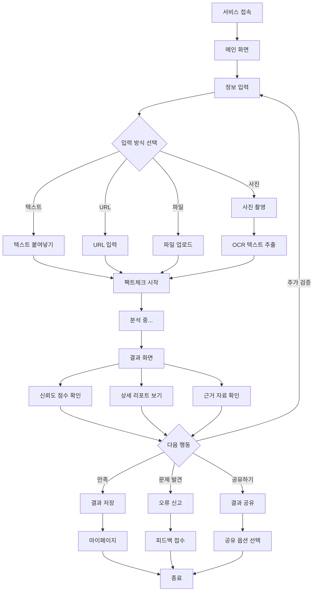

# FactCheck (가칭) - 서비스 기획안

> 도서관 이용자와 학생들을 위한 팩트체크 및 정정 서비스 MVP 기획

**작성일**: 2026년 1월 21일  
**버전**: 1.0  
**문서 유형**: 서비스 기획안

---

## 목차

1. [서비스 개요](#1-서비스-개요)
2. [문제 정의 및 배경](#2-문제-정의-및-배경)
3. [타겟 사용자](#3-타겟-사용자)
4. [핵심 가치 제안](#4-핵심-가치-제안)
5. [주요 기능 정의](#5-주요-기능-정의)
6. [사용자 시나리오](#6-사용자-시나리오)
7. [사용자 플로우](#7-사용자-플로우)
8. [정보 구조](#8-정보-구조)
9. [MVP 범위 정의](#9-mvp-범위-정의)
10. [성공 지표](#10-성공-지표-kpi)
11. [향후 확장 방향](#11-향후-확장-방향)

---

## 1. 서비스 개요

### 서비스 이름
**FactCheck** (가칭)

### 한 줄 설명
도서관 이용자와 학생들이 정보의 진위를 확인하고 신뢰할 수 있는 자료 조사를 할 수 있도록 돕는 팩트체크 서비스

### 서비스 목적
- 정보 리터러시 향상
- 신뢰할 수 있는 학습 환경 제공
- 정보 검증 과정의 간소화와 접근성 향상

### 핵심 가치
정보의 홍수 속에서 진실을 찾는 과정을 쉽고 빠르게 만들어, 모든 사용자가 신뢰할 수 있는 정보를 기반으로 학습하고 의사결정을 할 수 있도록 지원합니다.

---

## 2. 문제 정의 및 배경

### 현재 문제점

#### 문제 1: 정보 신뢰도 판단의 어려움
- 온라인상에 넘쳐나는 정보 중 어떤 것이 신뢰할 수 있는지 판단하기 어려움
- 특히 도서관 이용자들은 학술 자료와 일반 자료를 구분하는 데 어려움을 겪음
- 출처가 불분명하거나 편향된 정보가 많아 혼란 발생

#### 문제 2: 학생들의 잘못된 정보 접근 위험
- 과제 준비 시 검증되지 않은 정보를 사용할 위험
- 토론이나 발표에서 부정확한 근거로 인한 신뢰도 하락
- 정보 출처 확인 방법을 모르는 학생들이 많음

#### 문제 3: 정보 검증에 소요되는 시간
- 수동으로 정보를 크로스체크하는 데 많은 시간 소요
- 여러 출처를 비교 분석하는 과정의 복잡성
- 전문적인 팩트체크 리소스 부족

### 해결 방안
손쉬운 팩트체크 도구를 제공하여 정보 검증 과정을 간소화하고, AI와 전문가 검증을 결합한 신뢰할 수 있는 결과를 제공합니다.

---

## 3. 타겟 사용자

### 주요 타겟 그룹

#### 1차 타겟: 공공도서관 이용자
- 일반 시민 (평생 학습자)
- 자료 조사가 필요한 직장인
- 독서 동호회 회원

#### 2차 타겟: 학교도서관 이용자
- 초중고 학생 (과제, 토론 준비)
- 대학생 (리포트, 논문 작성)
- 교사 및 교육자

### 사용자 페르소나

#### 페르소나 1: 김민준 (중학생, 15세)
**배경**
- 중학교 2학년, 토론 동아리 소속
- 토론 대회 준비 중

**니즈**
- 토론 근거 자료의 정확성 확인 필요
- 반대편 주장을 반박할 수 있는 신뢰할 수 있는 자료 필요
- 쉽고 빠른 검증 방법 필요

**페인 포인트**
- 인터넷에서 찾은 통계나 사실이 정확한지 확신이 없음
- 출처를 일일이 확인하는 것이 번거로움
- 학술 자료는 너무 어렵고 접근하기 힘듦

**기대 효과**
- 토론에서 자신감 있게 근거 제시
- 신뢰도 높은 자료로 설득력 향상

---

#### 페르소나 2: 이서연 (대학생, 22세)
**배경**
- 대학교 3학년, 사회학 전공
- 학기말 리포트 작성 중

**니즈**
- 인용할 자료의 신뢰도 검증 필요
- 다양한 출처를 빠르게 비교 분석
- 학술적으로 인정받을 수 있는 자료 필요

**페인 포인트**
- 여러 출처를 크로스체크하는 데 시간이 많이 소요됨
- 논문에 잘못된 정보를 인용할까 불안함
- 출처의 신뢰도를 판단하는 기준이 모호함

**기대 효과**
- 리포트 작성 시간 단축
- 더 신뢰할 수 있는 학술 자료 활용
- 학점 향상

---

#### 페르소나 3: 박영희 (일반 시민, 48세)
**배경**
- 회사원, 평생 학습에 관심 많음
- 주말마다 도서관에서 독서

**니즈**
- 책에서 읽은 내용의 사실 여부 확인
- 건강, 과학 관련 정보의 정확성 검증
- 믿을 수 있는 정보로 지식 쌓기

**페인 포인트**
- 책에 나온 내용이 항상 정확한지 의문
- 특히 건강, 다이어트 관련 정보는 혼란스러움
- 정보를 확인할 방법을 잘 모름

**기대 효과**
- 올바른 정보로 건강한 생활 습관 형성
- 더 깊이 있는 독서 경험
- 정보에 대한 비판적 사고력 향상

---

## 4. 핵심 가치 제안

### 차별화 포인트

#### 1. 다양한 입력 방식 지원
- **텍스트**: 의심스러운 문장이나 주장을 직접 입력
- **URL**: 웹페이지 링크로 간편하게 검증
- **파일**: PDF, 워드 문서 등을 통째로 업로드
- **사진**: 책이나 인쇄물을 사진으로 찍어 즉시 검증

→ 사용자가 어떤 상황에서든 편리하게 이용 가능

#### 2. AI + 전문가 결합 검증
- AI가 빠르게 1차 분석 수행
- 전문가 검증 데이터베이스와 연동
- 여러 출처를 종합하여 신뢰도 평가

→ 속도와 정확성을 동시에 확보

#### 3. 상세한 분석 리포트
- 단순 참/거짓이 아닌 맥락과 근거 제공
- 신뢰도 점수로 한눈에 파악
- 관련 자료와 반박 자료 함께 제시

→ 사용자가 스스로 판단할 수 있는 정보 제공

#### 4. 근거 자료 목록 제공 및 도서관 연계
- 검증에 사용된 모든 출처 공개
- 출처별 신뢰도 평가
- 원본 자료로 바로 이동 가능한 링크
- **해당 자료를 소장한 도서관 정보 제공**
- 도서관 홈페이지 및 위치 안내

→ 투명하고 신뢰할 수 있는 검증 과정 + 오프라인 자료 접근성 향상

---

## 5. 주요 기능 정의

### MVP 핵심 기능

#### 5.1 팩트체크 요청

##### 기능 상세
사용자가 다양한 방식으로 검증을 원하는 정보를 제출할 수 있습니다.

##### 입력 방식

**1) 텍스트 붙여넣기**
- 사용 시나리오: 의심스러운 문장이나 통계를 복사하여 붙여넣기
- 입력 제한: 최대 5,000자
- 특징: 가장 빠르고 간편한 방법

**2) URL 입력**
- 사용 시나리오: 온라인 기사, 블로그 글 등의 주소 입력
- 지원 형식: 웹페이지 URL
- 특징: 전체 맥락을 파악하여 분석 가능

**3) 파일 업로드**
- 사용 시나리오: 리포트, 논문 초안 등을 검증
- 지원 형식: PDF, DOCX, TXT
- 파일 크기 제한: 최대 10MB
- 특징: 여러 주장을 한번에 검증

**4) 사진 촬영**
- 사용 시나리오: 도서관에서 책을 읽다가 의심스러운 내용 발견
- 지원 기능: OCR을 통한 텍스트 추출
- 특징: 모바일에서 즉시 검증 가능

---

#### 5.2 팩트체크 결과 제공

##### 기능 상세
검증 결과를 명확하고 이해하기 쉽게 제공합니다.

##### 결과 구성 요소

**1) 신뢰도 점수 (0-100점)**
- 시각적 표현: 게이지 바, 색상 코딩
- 점수 구간별 의미:
  - 80-100점: 매우 신뢰할 수 있음 (녹색)
  - 60-79점: 대체로 신뢰할 수 있음 (연두색)
  - 40-59점: 주의 필요 (노란색)
  - 20-39점: 신뢰하기 어려움 (주황색)
  - 0-19점: 허위 정보 가능성 높음 (빨간색)

**2) 상세 분석 리포트**
- 핵심 요약: 3-5줄로 주요 내용 정리
- 주요 논점: 검증한 핵심 주장 목록
- 검증 내용: 각 주장별 사실 확인 결과
- 맥락 설명: 시간, 상황 등 추가 정보

**3) 근거 자료 목록**
- 출처명, 발행 기관, 발행일
- 출처별 신뢰도 평가
- 원문 링크
- 관련 부분 하이라이트
- **도서관 접근 정보**:
  - 해당 자료(논문, 책, 학술지)를 소장한 도서관 목록
  - 도서관별 소장 여부 및 대출 가능 여부
  - 도서관 홈페이지 링크 및 위치 정보
  - 온라인 원문 접근 가능 여부 (도서관 로그인 필요 시 안내)

**4) 유사/반박 자료 제시**
- 같은 주제를 다룬 다른 자료
- 다른 관점의 자료
- 추가로 읽을 만한 자료 추천
- 각 자료의 도서관 소장 정보

---

#### 5.3 결과 관리

##### 기능 상세
사용자가 검증 결과를 효과적으로 활용할 수 있도록 지원합니다.

**1) 결과 저장/북마크**
- 중요한 검증 결과를 저장
- 폴더별로 정리 가능
- 나중에 다시 찾아보기 쉽게 관리

**2) 결과 공유**
- 고유 링크 생성
- SNS 공유 (카카오톡, 트위터 등)
- 이메일로 전송
- 이미지로 저장 (스크린샷 형태)

**3) 오류 신고**
- 검증 결과가 잘못되었다고 판단될 때
- 신고 사유 선택 및 설명 작성
- 전문가 재검토 요청

---

### 향후 확장 기능 (MVP 이후)

#### Phase 2 고려 기능
- **커뮤니티 토론**: 사용자들이 검증 결과에 대해 토론
- **전문가 직접 검증 요청**: 복잡한 사안에 대해 전문가에게 직접 요청
- **팩트체크 히스토리 분석**: 개인의 검증 패턴 분석 및 인사이트 제공

---

## 6. 사용자 시나리오

### 시나리오 1: 자료 조사 (대학생 이서연)

**상황**  
경제학 리포트를 작성 중인 이서연은 블로그에서 흥미로운 경제 통계를 발견했습니다. 하지만 출처가 명확하지 않아 불안합니다.

**행동 흐름**
1. FactCheck 웹사이트에 접속
2. 블로그 URL을 복사하여 입력창에 붙여넣기
3. "팩트체크 시작" 버튼 클릭
4. 30초 후 결과 확인
   - 신뢰도 점수: 45점 (주의 필요)
   - 분석: 해당 통계는 10년 전 데이터이며, 최근 연구 결과와 다름
   - 근거 자료: 정부 통계청, 학술 논문 3편 제시
5. 제시된 학술 논문 중 하나를 선택
   - 논문 정보: "2024년 경제 동향 분석" (한국경제학회지)
   - **도서관 소장 정보 확인**: 학교 중앙도서관에 소장, 대출 가능
   - 도서관 위치 및 홈페이지 링크 확인
6. 학교 도서관에서 해당 논문 원문 확인 또는 온라인 열람
7. 결과를 "경제학 리포트" 폴더에 저장

**결과**  
더 신뢰할 수 있는 최신 자료로 리포트의 품질을 향상시킬 수 있었고, 도서관을 통해 학술 자료에 쉽게 접근할 수 있었습니다.

---

### 시나리오 2: 독서 중 검증 (일반인 박영희)

**상황**  
박영희는 도서관에서 건강 서적을 읽던 중 "하루 물 8잔을 마시는 것이 건강에 필수적이다"라는 내용을 접했습니다. 이전에 이와 다른 내용을 들은 기억이 나 확인하고 싶습니다.

**행동 흐름**
1. 스마트폰으로 FactCheck 앱 실행
2. "사진으로 검증" 기능 선택
3. 해당 페이지를 사진으로 촬영
4. OCR이 자동으로 텍스트 추출
5. "하루 물 8잔" 부분을 선택하여 팩트체크 요청
6. 결과 확인
   - 신뢰도 점수: 55점 (주의 필요)
   - 분석: 이는 오래된 속설이며, 실제 필요량은 개인차가 큼
   - 근거 자료: 의학 저널 논문, 영양학 전문가 칼럼 제시
7. 추천된 의학 저널 논문 확인
   - 논문: "수분 섭취와 건강에 관한 최신 연구" (대한의학회지, 2025)
   - **도서관 소장 정보**: 지역 공공도서관에 소장, 열람 가능
   - 가까운 도서관 위치 확인 (집에서 도보 10분 거리)
8. 상세 리포트를 읽고 올바른 정보 습득
9. 결과를 카카오톡으로 가족에게 공유

**결과**  
잘못된 건강 정보를 바로잡고, 가족과 올바른 정보를 공유할 수 있었습니다. 다음 주말에 도서관을 방문하여 더 자세한 건강 정보를 찾아볼 계획입니다.

---

### 시나리오 3: 토론 준비 (중학생 김민준)

**상황**  
김민준은 "플라스틱 빨대 금지가 환경 보호에 효과적이다"라는 주제로 토론 대회를 준비 중입니다. 찬성 측 근거 자료를 수집했지만, 이 자료들이 정확한지 확인이 필요합니다.

**행동 흐름**
1. 준비한 자료를 하나의 워드 문서로 정리
2. FactCheck에 접속하여 "파일 업로드" 선택
3. 워드 문서 업로드
4. 2분 후 종합 분석 결과 확인
   - 문서 내 5개 주장에 대한 개별 신뢰도 점수 제공
   - 주장 1: 85점 (신뢰할 수 있음)
   - 주장 2: 70점 (대체로 신뢰할 수 있음)
   - 주장 3: 35점 (신뢰하기 어려움) ⚠️
   - 주장 4: 90점 (매우 신뢰할 수 있음)
   - 주장 5: 65점 (대체로 신뢰할 수 있음)
5. 주장 3의 상세 리포트 확인
   - 해당 통계는 출처가 불분명한 블로그 글
   - 대안 자료 3개 제시 (과학 저널 논문)
6. 제시된 대안 자료로 주장 3을 대체
7. 최종 점검한 결과를 "토론 준비" 폴더에 저장

**결과**  
취약한 근거를 보완하여 토론에서 설득력을 높일 수 있었습니다.

---

## 7. 사용자 플로우

### 전체 플로우 다이어그램



### 세부 플로우: 팩트체크 요청

1. **입력 방식 선택**
   - 사용자가 가장 편한 방식 선택
   - 모바일: 사진이 기본 옵션
   - 웹: 텍스트/URL이 기본 옵션

2. **정보 입력**
   - 입력 형식에 맞게 정보 제공
   - 입력 중 실시간 가이드 제공
   - 입력 완료 시 미리보기 제공

3. **검증 옵션 선택 (선택사항)**
   - 빠른 검증 vs 상세 검증
   - 특정 분야 집중 (건강, 과학, 정치 등)

4. **팩트체크 시작**
   - 버튼 클릭 후 분석 시작
   - 진행 상황 표시
   - 예상 소요 시간 안내

### 세부 플로우: 결과 확인 및 활용

1. **결과 화면 진입**
   - 신뢰도 점수가 가장 먼저 표시
   - 스크롤하여 상세 내용 확인

2. **상세 내용 탐색**
   - 탭 또는 아코디언 형태로 정보 제공
   - 근거 자료 클릭 시 새 창에서 열람

3. **결과 활용**
   - 저장: 로그인 필요, 폴더 선택
   - 공유: 링크 복사, SNS 선택
   - 신고: 신고 사유 입력

---

## 8. 정보 구조

### 화면 구조 (Information Architecture)

#### 8.1 메인 화면

**구성 요소**
- **헤더**
  - 로고
  - 로그인/회원가입 버튼
  - 마이페이지 아이콘

- **히어로 섹션**
  - 서비스 소개 문구
  - 빠른 팩트체크 입력창 (대형)
  - 입력 방식 선택 탭 (텍스트/URL/파일/사진)

- **최근 팩트체크 섹션**
  - 내가 최근 검증한 항목 (로그인 시)
  - 각 항목: 제목, 신뢰도 점수, 날짜

- **인기 팩트체크 섹션**
  - 다른 사용자들이 많이 검증한 주제
  - 각 항목: 제목, 검증 횟수, 평균 신뢰도

- **푸터**
  - 서비스 소개
  - 이용약관
  - 개인정보처리방침
  - 문의하기

---

#### 8.2 팩트체크 진행 화면

**구성 요소**
- **입력 영역**
  - 입력 방식별 인터페이스
  - 입력 가이드 텍스트
  - 예시 보기 버튼

- **미리보기 영역**
  - 입력한 내용 확인
  - 수정하기 버튼

- **옵션 선택 영역 (선택사항)**
  - 검증 깊이 선택
  - 분야 선택

- **실행 버튼**
  - "팩트체크 시작" 버튼 (강조)

- **분석 중 화면**
  - 로딩 애니메이션
  - 진행 상황 (%)
  - 예상 대기 시간
  - 팁 메시지 (랜덤)

---

#### 8.3 팩트체크 결과 화면

**구성 요소**
- **헤더**
  - 뒤로가기 버튼
  - 액션 버튼 (저장, 공유, 신고)

- **신뢰도 점수 섹션**
  - 큰 숫자로 점수 표시
  - 게이지 바 (색상 코딩)
  - 점수에 대한 한 줄 설명

- **핵심 요약 섹션**
  - 3-5줄로 핵심 내용 정리
  - 읽기 쉬운 박스 형태

- **상세 분석 섹션**
  - 탭 구조:
    - "검증 내용" 탭
    - "근거 자료" 탭
    - "관련 자료" 탭
  
  **검증 내용 탭**
  - 주요 논점별 사실 확인
  - 맥락 설명
  - 주의사항

  **근거 자료 탭**
  - 출처 목록 (카드 형태)
  - 각 출처: 제목, 발행처, 날짜, 신뢰도, 링크
  - **도서관 소장 정보**:
    - 소장 도서관 목록 (아이콘으로 표시)
    - 대출 가능 여부 표시
    - "도서관에서 보기" 버튼
    - 클릭 시 도서관 상세 정보 (위치, 홈페이지, 이용 시간)
  
  **관련 자료 탭**
  - 유사 주제 자료
  - 반박 자료
  - 추가 읽을거리
  - 각 자료별 도서관 소장 여부 표시

- **액션 영역**
  - 저장하기 버튼
  - 공유하기 버튼
  - 오류 신고 버튼
  - 새로운 팩트체크 버튼

---

#### 8.4 마이페이지

**구성 요소**
- **프로필 섹션**
  - 사용자 이름
  - 검증 통계 (총 검증 횟수, 저장 수)

- **저장한 팩트체크 섹션**
  - 폴더별 정리
  - 검색 기능
  - 정렬 옵션 (최신순, 점수순)

- **팩트체크 히스토리 섹션**
  - 최근 검증한 항목들
  - 날짜별 타임라인

- **설정 섹션**
  - 알림 설정
  - 계정 설정
  - 로그아웃

---

### 정보 계층 구조

```
FactCheck
├── 메인 화면
│   ├── 빠른 팩트체크
│   ├── 최근 팩트체크
│   └── 인기 팩트체크
│
├── 팩트체크 진행
│   ├── 입력
│   ├── 옵션 선택
│   └── 분석 중
│
├── 결과 화면
│   ├── 신뢰도 점수
│   ├── 핵심 요약
│   ├── 상세 분석
│   │   ├── 검증 내용
│   │   ├── 근거 자료
│   │   └── 관련 자료
│   └── 액션
│
└── 마이페이지
    ├── 프로필
    ├── 저장함
    ├── 히스토리
    └── 설정
```

---

## 9. MVP 범위 정의

### 포함 사항 (Must Have)

#### 핵심 기능
- ✅ 4가지 입력 방식 (텍스트, URL, 파일, 사진)
- ✅ AI 기반 자동 팩트체크
- ✅ 신뢰도 점수 산정 (0-100점)
- ✅ 상세 분석 리포트 제공
- ✅ 근거 자료 목록 및 링크 제공
- ✅ **도서관 소장 정보 연계** (근거 자료를 소장한 도서관 정보 제공)
- ✅ 결과 저장 기능
- ✅ 결과 공유 기능 (링크, SNS)
- ✅ 오류 신고 기능

#### 사용자 기능
- ✅ 회원가입 및 로그인
- ✅ 마이페이지 (저장함, 히스토리)
- ✅ 검색 기능 (저장한 팩트체크 내)

#### 플랫폼
- ✅ 웹 서비스 (반응형 디자인)
- ✅ 모바일 웹 (모바일 브라우저 최적화)

#### 성능 요구사항
- ✅ 텍스트 분석: 30초 이내
- ✅ URL 분석: 1분 이내
- ✅ 파일 분석: 2분 이내
- ✅ 사진 OCR + 분석: 1분 이내

---

### 제외 사항 (향후 버전)

#### Phase 2 이후 고려
- ❌ 커뮤니티 토론 기능
- ❌ 댓글 및 평가 시스템
- ❌ 사용자 간 팔로우/팔로잉
- ❌ 실시간 전문가 검증 요청
- ❌ 유료 구독 모델
- ❌ 기관용 대시보드
- ❌ API 제공
- ❌ 브라우저 확장 프로그램
- ❌ 네이티브 모바일 앱 (iOS/Android)
- ❌ 다국어 지원
- ❌ 고급 분석 (트렌드, 통계)
- ❌ 개인화 추천
- ❌ 오프라인 모드

---

### MVP 개발 우선순위

#### Phase 1.0 - 핵심 검증 기능 (Launch)
1. 텍스트/URL 입력
2. 기본 팩트체크 및 결과 제공
3. 회원가입/로그인
4. 결과 저장/공유

#### Phase 1.1 - 입력 방식 확장
1. 파일 업로드 기능
2. 사진 촬영 및 OCR

#### Phase 1.2 - 사용자 경험 개선
1. 마이페이지 고도화
2. 검색 및 필터링
3. 오류 신고 처리

---

## 10. 성공 지표 (KPI)

### 핵심 지표

#### 1. 사용자 지표
- **월간 활성 사용자 (MAU)**
  - 목표: 론칭 3개월 내 5,000명
  - 측정: 한 달 동안 1회 이상 팩트체크를 실행한 사용자 수

- **일간 활성 사용자 (DAU)**
  - 목표: MAU의 10-15%
  - 측정: 하루 동안 1회 이상 팩트체크를 실행한 사용자 수

- **신규 가입자 수**
  - 목표: 주간 100명 이상
  - 측정: 주간 신규 회원가입 완료 수

#### 2. 사용성 지표
- **팩트체크 요청 수**
  - 목표: 월간 10,000건 이상
  - 측정: 모든 팩트체크 요청의 총합

- **사용자당 평균 팩트체크 횟수**
  - 목표: 사용자당 월 2회 이상
  - 측정: 총 팩트체크 수 / MAU

- **결과 저장률**
  - 목표: 40% 이상
  - 측정: 저장한 결과 수 / 전체 팩트체크 수

- **결과 공유율**
  - 목표: 15% 이상
  - 측정: 공유한 결과 수 / 전체 팩트체크 수

#### 3. 만족도 지표
- **재방문율**
  - 목표: 50% 이상
  - 측정: 7일 내 재방문한 사용자 비율

- **평균 세션 시간**
  - 목표: 5분 이상
  - 측정: 사용자의 평균 체류 시간

- **오류 신고율**
  - 목표: 5% 미만
  - 측정: 오류 신고 건수 / 전체 팩트체크 수
  - 낮을수록 좋음

#### 4. 입력 방식별 사용률
- **텍스트 입력**
  - 목표: 40-50%
  
- **URL 입력**
  - 목표: 30-40%
  
- **파일 업로드**
  - 목표: 10-15%
  
- **사진 촬영**
  - 목표: 5-10%

### 모니터링 방법
- Google Analytics 또는 Mixpanel 활용
- 사용자 행동 트래킹
- 주간 리포트 자동 생성
- 월간 성과 검토 회의

---

## 11. 향후 확장 방향

### Phase 2: 커뮤니티 기능 및 도서관 연계 고도화 (론칭 후 6개월)

#### 주요 기능
- **커뮤니티 토론**
  - 팩트체크 결과에 대한 토론 공간
  - 댓글 및 의견 교환
  - 찬성/반대 투표

- **사용자 신뢰도 평가 시스템**
  - 활동 내역 기반 사용자 신뢰도
  - 배지 및 레벨 시스템
  - 우수 기여자 인정

- **도서관 연계 고도화**
  - 전국 공공도서관 네트워크 API 연동 (국립중앙도서관, 지역 도서관)
  - 실시간 대출 가능 여부 확인
  - 도서관 예약 기능 (바로 예약하기)
  - 사용자 위치 기반 가까운 도서관 우선 표시
  - 도서관 방문 후기 및 평가

#### 기대 효과
- 사용자 참여도 향상
- 자발적 정보 검증 문화 형성
- 커뮤니티 기반 지식 축적
- **도서관 이용률 증가 및 오프라인 연계 강화**

---

### Phase 3: 전문가 네트워크 (론칭 후 12개월)

#### 주요 기능
- **전문가 네트워크 구축**
  - 각 분야 전문가 등록
  - 전문가 프로필 및 이력 공개
  - 전문가 직접 검증 요청

- **기관용 API 제공**
  - 도서관, 학교 등에 API 제공
  - 자체 시스템과 연동 가능
  - 사용량 기반 요금제

#### 기대 효과
- 검증 신뢰도 대폭 향상
- B2B 수익 모델 확보
- 기관과의 파트너십 구축

---

### Phase 4: 기관 라이선스 및 확장 (론칭 후 18개월)

#### 주요 기능
- **도서관/학교 기관 라이선스**
  - 기관 전용 대시보드
  - 통계 및 분석 리포트
  - 관리자 기능
  - 대량 검증 지원

- **브라우저 확장 프로그램**
  - Chrome, Firefox, Edge 등 지원
  - 웹서핑 중 즉시 팩트체크
  - 의심스러운 내용 자동 감지

- **챗봇 인터페이스**
  - 대화형 팩트체크
  - 카카오톡, 네이버 라인 연동
  - 간편한 모바일 접근

#### 기대 효과
- 기관 고객 확보로 안정적 수익
- 사용자 접근성 극대화
- 일상 속 팩트체크 문화 정착

---

### 장기 비전

#### 비전 1: 정보 리터러시 교육 플랫폼
- 팩트체크를 넘어 정보 리터러시 교육 콘텐츠 제공
- 학교 교육과정과 연계
- 인증 프로그램 운영

#### 비전 2: 글로벌 팩트체크 네트워크
- 다국어 지원
- 글로벌 전문가 네트워크
- 국제 팩트체크 기관과 협력

#### 비전 3: AI 팩트체크 기술 선도
- 자체 팩트체크 AI 모델 개발
- 기술 라이선싱
- 연구 기관과의 협업

---

## 부록

### 참고 자료
- 국내외 팩트체크 서비스 사례
- 정보 리터러시 관련 연구
- 도서관 이용자 설문조사 결과

### 용어 정의
- **팩트체크**: 특정 주장이나 정보의 사실 여부를 확인하는 과정
- **정보 리터러시**: 정보를 찾고, 평가하고, 효과적으로 사용하는 능력
- **OCR**: 광학 문자 인식 (Optical Character Recognition), 이미지에서 텍스트를 추출하는 기술
- **신뢰도 점수**: 정보의 신뢰성을 0-100점 척도로 수치화한 지표

---

**문서 끝**

이 기획안은 MVP 개발을 위한 기초 문서이며, 개발 과정에서 사용자 피드백과 시장 상황에 따라 지속적으로 업데이트될 예정입니다.
