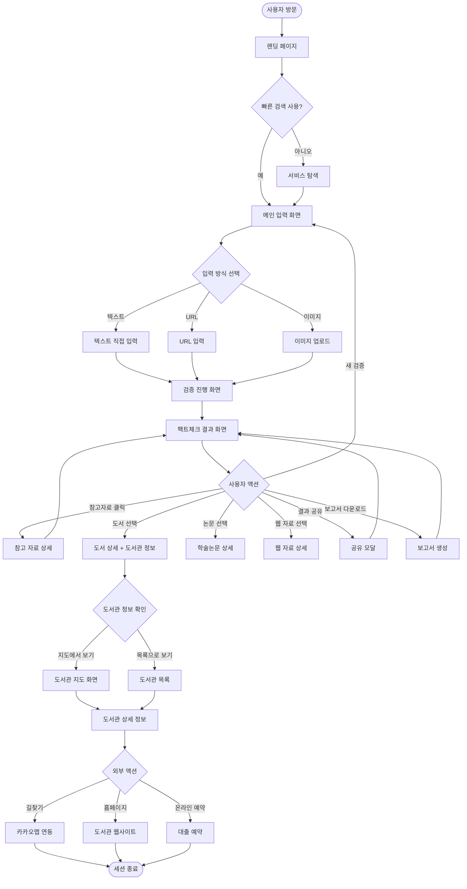

# FactChecker Wireframe 문서

## 목차

1. [전체 사용자 플로우](#1-전체-사용자-플로우)
2. [주요 화면별 Wireframe](#2-주요-화면별-wireframe)
   - 2.1 [랜딩/홈 페이지](#21-랜딩홈-페이지)
   - 2.2 [메인 입력 화면](#22-메인-입력-화면)
   - 2.3 [검증 진행 화면](#23-검증-진행-화면)
   - 2.4 [팩트체크 결과 화면](#24-팩트체크-결과-화면)
   - 2.5 [참고 자료 상세 화면](#25-참고-자료-상세-화면)
   - 2.6 [도서관 연계 전용 화면](#26-도서관-연계-전용-화면)
   - 2.7 [공통 컴포넌트](#27-공통-컴포넌트)
3. [디자인 시스템 가이드라인](#3-디자인-시스템-가이드라인)

---

## 1. 전체 사용자 플로우

### 1.1 사용자 여정 플로우차트



### 1.2 주요 사용자 시나리오별 경로

#### 시나리오 A: 텍스트 팩트체크 → 결과 확인
```
랜딩 → 메인 입력 → 텍스트 입력 → 검증 진행 → 결과 확인 → 종료
```

#### 시나리오 B: URL 검증 → 도서 찾기 → 도서관 방문
```
랜딩 → 메인 입력 → URL 입력 → 검증 진행 → 결과 확인 → 
도서 상세 → 도서관 목록 → 도서관 상세 → 길찾기
```

#### 시나리오 C: 이미지 검증 → 참고자료 열람 → 재검증
```
랜딩 → 메인 입력 → 이미지 업로드 → 검증 진행 → 결과 확인 → 
논문 상세 → 결과로 복귀 → 새로운 검증 시작
```

---

## 2. 주요 화면별 Wireframe

### 2.1 랜딩/홈 페이지

#### 화면 목적
- 서비스의 가치 제안을 명확히 전달
- 사용자의 즉각적인 액션 유도 (빠른 검색)
- 서비스의 주요 기능 소개

#### 레이아웃 구조

```
┌─────────────────────────────────────────────────────────────┐
│  [Logo] FactChecker            [홈] [소개] [사용법] [로그인] │
└─────────────────────────────────────────────────────────────┘

┌─────────────────────────────────────────────────────────────┐
│                     HERO SECTION                              │
│                                                               │
│          진실을 확인하고, 지식을 발견하세요                      │
│                                                               │
│     AI와 학술자료 기반으로 정보를 검증하고                       │
│         가까운 도서관에서 더 깊은 지식을 찾아보세요              │
│                                                               │
│   ┌───────────────────────────────────────────────────┐     │
│   │  검증하고 싶은 정보를 입력하세요...         [🔍]   │     │
│   └───────────────────────────────────────────────────┘     │
│                                                               │
│   [텍스트 입력] [URL 입력] [이미지 업로드]                    │
│                                                               │
└─────────────────────────────────────────────────────────────┘

┌─────────────────────────────────────────────────────────────┐
│               주요 기능 (3-Column Grid)                        │
│                                                               │
│  ┌─────────┐    ┌─────────┐    ┌─────────┐                  │
│  │  [📝]   │    │  [🔗]   │    │  [📸]   │                  │
│  │         │    │         │    │         │                  │
│  │  텍스트  │    │   URL   │    │  이미지  │                  │
│  │  입력   │    │   입력   │    │  업로드  │                  │
│  │         │    │         │    │         │                  │
│  │ 의심스러운│    │ 뉴스 기사│    │스크린샷과│                  │
│  │ 주장을   │    │ 블로그   │    │ 사진을   │                  │
│  │ 직접 입력│    │ SNS 링크 │    │ 바로 검증│                  │
│  └─────────┘    └─────────┘    └─────────┘                  │
│                                                               │
└─────────────────────────────────────────────────────────────┘

┌─────────────────────────────────────────────────────────────┐
│                  신뢰할 수 있는 검증                           │
│                                                               │
│   ✓ 학술논문 기반 검증        ✓ 전국 도서관 연계               │
│   ✓ 정부 공식 자료 활용       ✓ 다층적 신뢰도 평가             │
│                                                               │
└─────────────────────────────────────────────────────────────┘

┌─────────────────────────────────────────────────────────────┐
│              최근 인기 팩트체크 (Optional)                     │
│                                                               │
│  ┌──────────────────────┐  ┌──────────────────────┐         │
│  │ "비타민 C가 감기를     │  │ "한국인 평균 수면시간  │         │
│  │  예방한다"            │  │  세계 최하위"         │         │
│  │                      │  │                      │         │
│  │ [주의가 필요함] 45점   │  │ [대체로 사실임] 75점   │         │
│  │ 1,234명 조회         │  │ 2,567명 조회         │         │
│  └──────────────────────┘  └──────────────────────┘         │
│                                                               │
└─────────────────────────────────────────────────────────────┘

┌─────────────────────────────────────────────────────────────┐
│                        FOOTER                                 │
│  About | Contact | Privacy | Terms | FAQ                     │
│  © 2026 FactChecker. All rights reserved.                    │
└─────────────────────────────────────────────────────────────┘
```

#### 주요 컴포넌트

**1. 헤더 (Header)**
- 로고 (좌측 상단)
- 네비게이션 메뉴: 홈, 소개, 사용법, 로그인/회원가입
- 고정(sticky) 헤더로 스크롤 시에도 항상 표시

**2. 히어로 섹션 (Hero Section)**
- 캐치프레이즈: "진실을 확인하고, 지식을 발견하세요"
- 서브 헤딩: 서비스 핵심 가치 제안
- 빠른 검색바: 메인 CTA
  - 입력 필드: 큰 사이즈, 플레이스홀더 텍스트
  - 검색 버튼 (돋보이는 색상)
- 입력 방식 탭 프리뷰: 3가지 옵션 표시

**3. 주요 기능 카드 (Feature Cards)**
- 3-column 그리드 레이아웃
- 각 카드: 아이콘, 제목, 짧은 설명
- 호버 시 약간의 elevation 효과

**4. 신뢰성 지표 (Trust Indicators)**
- 4개의 주요 특징을 아이콘과 함께 표시
- 서비스의 신뢰성과 전문성 강조

**5. 최근 인기 팩트체크 (Optional)**
- 2-column 카드 레이아웃
- 각 카드: 검증 대상 텍스트, 판정 배지, 점수, 조회수
- 클릭 시 해당 결과 페이지로 이동

**6. 푸터 (Footer)**
- 링크 모음: About, Contact, Privacy, Terms, FAQ
- 저작권 정보

#### 인터랙션 및 상태

- **빠른 검색바 포커스**: 입력 필드 확대 애니메이션
- **입력 방식 선택**: 탭 클릭 시 메인 입력 화면으로 이동하며 해당 탭 활성화
- **기능 카드 호버**: 약간 위로 올라가는 애니메이션 (translateY -4px)
- **스크롤 애니메이션**: 섹션별 fade-in 효과

#### 반응형 고려사항

**데스크톱 (>1200px)**
- 3-column 그리드 유지
- 히어로 섹션 full-width 배경 이미지/그라데이션

**태블릿 (768-1199px)**
- 기능 카드: 3-column 유지 (카드 크기 축소)
- 인기 팩트체크: 1-column으로 전환
- 폰트 사이즈 약간 축소

**모바일 (< 768px)**
- 1-column 레이아웃
- 빠른 검색바 단순화
- 네비게이션: 햄버거 메뉴로 전환

---

### 2.2 메인 입력 화면

#### 화면 목적
- 사용자가 검증하고자 하는 정보를 다양한 방식으로 입력할 수 있도록 지원
- 입력 방식에 따른 명확한 가이드 제공
- 검증 시작 액션 유도

#### 레이아웃 구조

```
┌─────────────────────────────────────────────────────────────┐
│  [Logo] FactChecker        [홈] [내역] [설정]          [사용자]│
└─────────────────────────────────────────────────────────────┘

┌─────────────────────────────────────────────────────────────┐
│                    정보 검증하기                              │
│              검증하고 싶은 정보를 입력해주세요                  │
│                                                               │
└─────────────────────────────────────────────────────────────┘

┌─────────────────────────────────────────────────────────────┐
│  ┌─────────────────────────────────────────────────────┐    │
│  │ [📝 텍스트 입력] [🔗 URL 입력] [📸 이미지 업로드]    │    │
│  └─────────────────────────────────────────────────────┘    │
│                                                               │
│  ┌─────────────────────────────────────────────────────┐    │
│  │                                                       │    │
│  │  TAB 1: 텍스트 입력 (활성화 상태)                      │    │
│  │                                                       │    │
│  │  ┌─────────────────────────────────────────────┐    │    │
│  │  │                                               │    │    │
│  │  │  검증하고 싶은 내용을 입력해주세요            │    │    │
│  │  │                                               │    │    │
│  │  │  예: "마늘을 매일 먹으면 암을 예방할 수 있다" │    │    │
│  │  │                                               │    │    │
│  │  │                                               │    │    │
│  │  │                                               │    │    │
│  │  │                                               │    │    │
│  │  │                                               │    │    │
│  │  └─────────────────────────────────────────────┘    │    │
│  │                                          0 / 5000자 │    │
│  │                                                       │    │
│  └─────────────────────────────────────────────────────┘    │
│                                                               │
│  ┌─────────────────────────────────────────────────────┐    │
│  │            [✓ 팩트체크 시작하기]                      │    │
│  └─────────────────────────────────────────────────────┘    │
│                                                               │
└─────────────────────────────────────────────────────────────┘

┌─────────────────────────────────────────────────────────────┐
│                      사용 예시                                │
│                                                               │
│  💡 이런 정보를 검증할 수 있어요:                              │
│     • 건강 정보: "비타민 C가 감기를 예방한다"                   │
│     • 뉴스 주장: "한국 청년 실업률이 역대 최고"                 │
│     • 과학 정보: "지구 온난화는 거짓이다"                       │
│                                                               │
└─────────────────────────────────────────────────────────────┘

┌─────────────────────────────────────────────────────────────┐
│                     검색 히스토리                              │
│                                                               │
│  최근 검색                                                     │
│  ○ "비타민 D 효능"                           [재검증]          │
│  ○ "플라스틱 재활용률"                       [재검증]          │
│  ○ "커피와 건강의 관계"                      [재검증]          │
│                                                               │
└─────────────────────────────────────────────────────────────┘
```

#### 탭별 상세 레이아웃

**TAB 2: URL 입력**

```
┌─────────────────────────────────────────────────────────────┐
│  URL 입력                                                     │
│                                                               │
│  ┌─────────────────────────────────────────────────────┐    │
│  │ https://                                     [붙여넣기]│    │
│  └─────────────────────────────────────────────────────┘    │
│                                                               │
│  지원 가능한 URL:                                              │
│  • 뉴스 기사 (대부분의 언론사)                                 │
│  • 블로그 포스트                                               │
│  • SNS 게시물 (공개 게시물에 한함)                             │
│                                                               │
│  ┌─────────────────────────────────────────────────────┐    │
│  │            미리보기 영역                              │    │
│  │                                                       │    │
│  │  [썸네일]  제목: ...                                  │    │
│  │            출처: ...                                  │    │
│  │            게시일: ...                                │    │
│  │                                                       │    │
│  └─────────────────────────────────────────────────────┘    │
│                                                               │
└─────────────────────────────────────────────────────────────┘
```

**TAB 3: 이미지 업로드**

```
┌─────────────────────────────────────────────────────────────┐
│  이미지 업로드                                                 │
│                                                               │
│  ┌─────────────────────────────────────────────────────┐    │
│  │                                                       │    │
│  │              [📷 이미지 아이콘]                       │    │
│  │                                                       │    │
│  │       이미지를 드래그하거나 클릭하여 업로드            │    │
│  │                                                       │    │
│  │            JPG, PNG, GIF (최대 10MB)                  │    │
│  │                                                       │    │
│  │                                                       │    │
│  └─────────────────────────────────────────────────────┘    │
│                                                               │
│  팁:                                                          │
│  • 텍스트가 선명하게 보이는 이미지를 업로드해주세요             │
│  • 스크린샷, 사진, 전단지 등 모두 가능합니다                   │
│                                                               │
│  ┌─────────────────────────────────────────────────────┐    │
│  │  업로드된 이미지 (업로드 후 표시)                      │    │
│  │                                                       │    │
│  │  [이미지 썸네일]                      [✕ 삭제]        │    │
│  │                                                       │    │
│  │  인식된 텍스트:                                       │    │
│  │  "..."                                                │    │
│  │                                    [텍스트 수정하기]   │    │
│  │                                                       │    │
│  └─────────────────────────────────────────────────────┘    │
│                                                               │
└─────────────────────────────────────────────────────────────┘
```

#### 주요 컴포넌트

**1. 헤더**
- 로고 (홈으로 이동)
- 네비게이션: 홈, 내역, 설정
- 사용자 프로필 아이콘 (로그인 시)

**2. 페이지 타이틀**
- 메인 타이틀: "정보 검증하기"
- 서브 타이틀: "검증하고 싶은 정보를 입력해주세요"

**3. 입력 방식 탭**
- 3개의 탭: 텍스트, URL, 이미지
- 활성화된 탭: 강조 색상, 하단 border
- 비활성화 탭: 회색톤

**4. 입력 영역 (탭별로 다름)**
- **텍스트 탭**: 
  - 큰 textarea (최소 높이 200px)
  - 글자 수 카운터 (5000자 제한)
  - 플레이스홀더 예시 포함
- **URL 탭**:
  - URL 입력 필드
  - 붙여넣기 버튼
  - URL 입력 후 미리보기 영역 표시
  - 지원 URL 타입 안내
- **이미지 탭**:
  - 드래그 앤 드롭 영역 (Dropzone)
  - 파일 선택 버튼
  - 업로드 후 이미지 썸네일 + OCR 결과 표시
  - OCR 텍스트 수정 기능

**5. 검증 시작 버튼 (CTA)**
- 큰 사이즈, 눈에 띄는 색상 (Primary color)
- 입력이 없으면 비활성화 상태
- 로딩 상태 표시 가능

**6. 사용 예시**
- 사용자가 어떤 정보를 검증할 수 있는지 구체적 예시 제공
- 카테고리별로 예시 나열

**7. 검색 히스토리 (사이드바 또는 하단)**
- 최근 검색한 내역 3-5개 표시
- 각 항목 클릭 시 해당 결과로 이동
- "재검증" 버튼으로 동일 쿼리 재실행 가능

#### 인터랙션 및 상태

**입력 검증**
- 텍스트: 최소 10자 이상 입력 시 검증 버튼 활성화
- URL: 유효한 URL 형식 확인 후 미리보기 로드
- 이미지: 파일 업로드 완료 후 OCR 자동 실행

**상태 표시**
- 로딩 상태: URL 미리보기 로드 중, OCR 처리 중
- 에러 상태: 잘못된 URL, 이미지 업로드 실패, OCR 실패
- 성공 상태: 입력 완료, 검증 준비 완료

**애니메이션**
- 탭 전환: 부드러운 fade-in/out
- 미리보기 영역: slide-down 애니메이션
- 드래그 앤 드롭: 드래그 오버 시 배경색 변경

#### 반응형 고려사항

**데스크톱 (>1200px)**
- 중앙 정렬, 최대 너비 800px
- 검색 히스토리: 우측 사이드바 (300px)

**태블릿 (768-1199px)**
- 중앙 정렬, 최대 너비 700px
- 검색 히스토리: 하단 섹션으로 이동

**모바일 (< 768px)**
- Full-width 레이아웃
- 탭 아이콘만 표시 (텍스트 숨김)
- 검색 히스토리: 접을 수 있는 아코디언

---

### 2.3 검증 진행 화면

#### 화면 목적
- 검증이 진행 중임을 명확히 전달
- 예상 소요 시간 안내로 사용자 불안감 해소
- 검증 단계별 진행 상황 시각화

#### 레이아웃 구조

```
┌─────────────────────────────────────────────────────────────┐
│  [Logo] FactChecker                                          │
└─────────────────────────────────────────────────────────────┘

┌─────────────────────────────────────────────────────────────┐
│                                                               │
│                                                               │
│                                                               │
│                     [로딩 애니메이션]                          │
│                                                               │
│                   정보를 검증하고 있습니다                      │
│                                                               │
│                                                               │
└─────────────────────────────────────────────────────────────┘

┌─────────────────────────────────────────────────────────────┐
│                    진행 상태                                  │
│                                                               │
│  ✓ 정보 분석 중... (완료)                                      │
│  ⟳ 학술자료 검색 중... (진행 중)                               │
│  ○ 도서관 정보 조회 중...                                      │
│  ○ 검증 결과 생성 중...                                        │
│                                                               │
└─────────────────────────────────────────────────────────────┘

┌─────────────────────────────────────────────────────────────┐
│                   예상 소요 시간: 약 15-30초                   │
│                                                               │
│  ┌─────────────────────────────────────────────────────┐    │
│  │ ████████████████░░░░░░░░░░░░░░░░░░░░░░░░░░░░░░      │    │
│  └─────────────────────────────────────────────────────┘    │
│                         40%                                   │
│                                                               │
└─────────────────────────────────────────────────────────────┘

┌─────────────────────────────────────────────────────────────┐
│                                                               │
│  💡 알고 계셨나요?                                             │
│                                                               │
│  FactChecker는 국립중앙도서관을 포함한 전국 도서관의            │
│  소장 정보를 실시간으로 확인하여, 검증에 사용된 도서를          │
│  가까운 도서관에서 직접 대출할 수 있도록 안내합니다.            │
│                                                               │
└─────────────────────────────────────────────────────────────┘
```

#### 주요 컴포넌트

**1. 최소 헤더**
- 로고만 표시 (심플한 디자인)

**2. 로딩 애니메이션**
- 중앙에 큰 사이즈로 표시
- 옵션:
  - 회전하는 원형 스피너
  - 돋보기 아이콘 애니메이션
  - 책이 넘어가는 애니메이션
  - 펄스(pulse) 효과

**3. 상태 메시지**
- 메인 메시지: "정보를 검증하고 있습니다"
- 차분하고 안정감 있는 타이포그래피

**4. 진행 단계 표시**
- 4단계 프로세스:
  1. ✓ 정보 분석 중 (완료)
  2. ⟳ 학술자료 검색 중 (진행 중)
  3. ○ 도서관 정보 조회 중 (대기)
  4. ○ 검증 결과 생성 중 (대기)
- 각 단계별 상태 아이콘 표시
- 완료: 체크마크 (초록색)
- 진행 중: 회전 아이콘 (파란색)
- 대기: 빈 원 (회색)

**5. 진행률 바**
- 수평 프로그레스 바 (0-100%)
- 예상 소요 시간 텍스트
- 퍼센트 표시

**6. 정보 팁 카드 (Optional)**
- 검증 대기 중 서비스 가치 재강조
- 랜덤 팁 또는 고정 메시지
- 예: 도서관 연계 기능 소개, 검증 방법론 설명 등

#### 인터랙션 및 상태

**진행 상태 업데이트**
- 실시간으로 현재 단계 업데이트
- WebSocket 또는 polling 방식으로 상태 확인
- 단계 전환 시 부드러운 애니메이션

**예상 시간 조정**
- 서버 응답에 따라 동적으로 예상 시간 업데이트
- 오래 걸리는 경우: "예상보다 시간이 조금 더 걸리고 있습니다" 메시지 표시

**취소 기능 (Optional)**
- 하단에 작은 "취소" 버튼 제공
- 클릭 시 검증 중단 및 입력 화면으로 복귀

#### 반응형 고려사항

**데스크톱 (>1200px)**
- 중앙 정렬, 최대 너비 600px
- 큰 로딩 애니메이션

**태블릿 (768-1199px)**
- 레이아웃 유지
- 애니메이션 크기 약간 축소

**모바일 (< 768px)**
- Full-width 레이아웃
- 진행 단계 텍스트 축약
- 정보 팁: 폰트 사이즈 축소 또는 제거

---

### 2.4 팩트체크 결과 화면

#### 화면 목적
- 검증 결과를 명확하고 직관적으로 표시
- 신뢰도 점수와 판정 단계를 시각적으로 강조
- 참고 자료를 체계적으로 제공
- 추가 액션 유도 (공유, 다운로드, 새 검증)

#### 레이아웃 구조

```
┌─────────────────────────────────────────────────────────────┐
│  [Logo] FactChecker        [홈] [내역] [설정]          [사용자]│
└─────────────────────────────────────────────────────────────┘

┌─────────────────────────────────────────────────────────────┐
│                    검증 결과                                  │
│                                                               │
│  ┌─────────────────────────────────────────────────────┐    │
│  │              결과 요약 카드                           │    │
│  │                                                       │    │
│  │          [⚠️ 주의가 필요함]                           │    │
│  │                                                       │    │
│  │               ┌─────────┐                            │    │
│  │               │   45    │                            │    │
│  │               │  ───    │  (게이지 차트)             │    │
│  │               │  100    │                            │    │
│  │               └─────────┘                            │    │
│  │                                                       │    │
│  │  "비타민 C가 감기를 '완전히 예방'한다는 주장은         │    │
│  │   과장되었습니다"                                     │    │
│  │                                                       │    │
│  └─────────────────────────────────────────────────────┘    │
│                                                               │
└─────────────────────────────────────────────────────────────┘

┌─────────────────────────────────────────────────────────────┐
│  검증 대상                                                     │
│  ┌─────────────────────────────────────────────────────┐    │
│  │ "비타민 C를 매일 1000mg씩 먹으면 감기를 완전히       │    │
│  │  예방할 수 있다"                                      │    │
│  └─────────────────────────────────────────────────────┘    │
│                                                               │
└─────────────────────────────────────────────────────────────┘

┌─────────────────────────────────────────────────────────────┐
│  상세 설명                                                     │
│                                                               │
│  비타민 C가 감기를 '완전히 예방'한다는 주장은 과장되었습니다.  │
│  2013년과 2020년에 발표된 코크란 리뷰에 따르면, 비타민 C는     │
│  일반인에게 감기 예방 효과가 거의 없으며, 감기 증상의 지속     │
│  기간을 약간 단축시킬 수는 있지만 '완전한 예방'은 불가능합니다.│
│                                                               │
│  주요 근거:                                                    │
│  • 일반인에게는 감기 예방 효과 제한적                          │
│  • 고강도 운동하는 사람들에게는 일부 예방 효과 관찰             │
│  • 증상 지속 기간을 8% 정도 단축 (통계적으로 미미)             │
│  • '완전한 예방'은 과학적으로 입증되지 않음                     │
│                                                               │
└─────────────────────────────────────────────────────────────┘

┌─────────────────────────────────────────────────────────────┐
│  참고 자료                                                     │
│  ┌─────────────────────────────────────────────────────┐    │
│  │ [📚 학술논문 (5)] [📖 도서 (3)] [🌐 웹 자료 (4)]     │    │
│  └─────────────────────────────────────────────────────┘    │
│                                                               │
│  ┌─────────────────────────────────────────────────────┐    │
│  │  학술논문 목록                                        │    │
│  │                                                       │    │
│  │  1. Vitamin C for preventing and treating the        │    │
│  │     common cold                                       │    │
│  │     Hemilä H, Chalker E | Cochrane Database, 2013    │    │
│  │     DOI: 10.1002/14651858.CD000980.pub4              │    │
│  │     [상세보기] [원문 링크]                             │    │
│  │                                                       │    │
│  │  ─────────────────────────────────────────────       │    │
│  │                                                       │    │
│  │  2. Vitamin C supplementation and respiratory         │    │
│  │     infections: a systematic review                   │    │
│  │     Ran L et al. | Military Med Research, 2018        │    │
│  │     DOI: 10.1186/s40779-018-0173-9                    │    │
│  │     [상세보기] [원문 링크]                             │    │
│  │                                                       │    │
│  │  ─────────────────────────────────────────────       │    │
│  │                                                       │    │
│  │  ... (더보기)                                         │    │
│  │                                                       │    │
│  └─────────────────────────────────────────────────────┘    │
│                                                               │
└─────────────────────────────────────────────────────────────┘

┌─────────────────────────────────────────────────────────────┐
│  액션 버튼                                                     │
│                                                               │
│  [🔗 결과 공유하기] [📄 상세 보고서 다운로드] [🔍 새로운 검증] │
│                                                               │
└─────────────────────────────────────────────────────────────┘
```

#### 주요 컴포넌트

**1. 헤더**
- 전체 헤더 (메인 입력 화면과 동일)

**2. 결과 요약 카드 (핵심)**
- **판정 배지**: 
  - "사실로 확인됨" (초록색)
  - "대체로 사실임" (연두색)
  - "주의가 필요함" (노란색)
  - "사실이 아님" (빨간색)
  - "판단 불가" (회색)
- **신뢰도 점수**: 
  - 큰 숫자로 표시 (예: 45/100)
  - 반원형 게이지 차트 또는 원형 프로그레스
  - 점수 범위에 따라 색상 변화
- **한 줄 요약**: 
  - 결과에 대한 간결한 설명 (1-2문장)
- 카드 디자인: 그림자(shadow), 약간의 elevation

**3. 검증 대상 표시**
- 사용자가 입력한 원문 텍스트
- 회색 배경 박스로 구분
- 인용문 형태로 표시

**4. 상세 설명 섹션**
- 왜 이런 판정이 나왔는지 상세 설명 (3-5 문단)
- 주요 근거를 bullet points로 정리
- 읽기 쉬운 타이포그래피 (line-height 1.6-1.8)

**5. 참고 자료 섹션**
- **탭 구조**:
  - 학술논문 (개수 표시)
  - 도서 (개수 표시)
  - 웹 자료 (개수 표시)
- 활성화된 탭의 자료 목록 표시

**6. 학술논문 리스트 아이템**
- 논문 제목 (볼드)
- 저자명
- 출판 정보 (학술지명, 연도)
- DOI 링크
- 액션 버튼: [상세보기] [원문 링크]
- 구분선으로 각 논문 구분

**7. 도서 리스트 아이템** (핵심 차별화)
- 책 제목 (볼드)
- 저자, 출판사, 출판 연도
- ISBN
- **도서관 소장 정보**: 
  - "전국 12개 도서관 소장"
  - 가까운 도서관 3곳 미리보기
  - "대출 가능" / "대출 중" 상태 표시
- 액션 버튼: [상세보기] [도서관 찾기]

**8. 웹 자료 리스트 아이템**
- 제목
- 출처 (사이트명)
- 게시일
- 신뢰도 아이콘 (정부/공공기관/언론사)
- 액션 버튼: [상세보기] [외부 링크]

**9. 액션 버튼 영역**
- **결과 공유하기**: SNS, 링크 복사
- **상세 보고서 다운로드**: PDF 형태
- **새로운 검증**: 메인 입력 화면으로 이동

#### 인터랙션 및 상태

**탭 전환**
- 학술논문/도서/웹 자료 탭 클릭 시 해당 목록으로 전환
- 부드러운 fade 애니메이션

**리스트 아이템 클릭**
- "상세보기" 클릭 시: 해당 자료의 상세 화면으로 이동
- "원문 링크" / "외부 링크" 클릭 시: 새 탭에서 열기
- "도서관 찾기" 클릭 시: 도서관 소장 정보 상세 화면으로 이동

**공유 버튼 클릭**
- 모달 또는 드롭다운으로 공유 옵션 표시
- 링크 복사 시 "클립보드에 복사되었습니다" 토스트 메시지

**다운로드 버튼 클릭**
- 로딩 인디케이터 표시
- PDF 생성 후 자동 다운로드

#### 반응형 고려사항

**데스크톱 (>1200px)**
- 결과 요약 카드: 중앙 정렬, 최대 너비 900px
- 참고 자료: 2-column 레이아웃 가능

**태블릿 (768-1199px)**
- 1-column 레이아웃
- 액션 버튼: 2행으로 배치

**모바일 (< 768px)**
- Full-width 레이아웃
- 게이지 차트 크기 축소
- 액션 버튼: 세로로 스택
- 탭 텍스트 축약 (아이콘 + 개수만)

---

### 2.5 참고 자료 상세 화면

#### 2.5.1 학술논문 상세 화면

##### 화면 목적
- 논문의 상세 정보 제공
- 원문 접근 경로 안내
- 검증 대상과의 관련성 설명

##### 레이아웃 구조

```
┌─────────────────────────────────────────────────────────────┐
│  [Logo] FactChecker        [←뒤로가기]               [사용자]│
└─────────────────────────────────────────────────────────────┘

┌─────────────────────────────────────────────────────────────┐
│  학술논문 상세                                                 │
│                                                               │
│  ┌─────────────────────────────────────────────────────┐    │
│  │  Vitamin C for preventing and treating the           │    │
│  │  common cold                                          │    │
│  │                                                       │    │
│  │  저자: Hemilä H, Chalker E                            │    │
│  │  출판: Cochrane Database of Systematic Reviews       │    │
│  │  발행일: 2013                                         │    │
│  │  DOI: 10.1002/14651858.CD000980.pub4                 │    │
│  │  인용 횟수: 1,234회                                   │    │
│  │                                                       │    │
│  │  [📄 원문 보기] [🔗 DOI 링크] [📋 인용하기]          │    │
│  │                                                       │    │
│  └─────────────────────────────────────────────────────┘    │
│                                                               │
└─────────────────────────────────────────────────────────────┘

┌─────────────────────────────────────────────────────────────┐
│  초록 (Abstract)                                              │
│                                                               │
│  This systematic review evaluates the efficacy of vitamin    │
│  C for the prevention and treatment of the common cold...    │
│                                                               │
│  [전체 보기]                                                   │
│                                                               │
└─────────────────────────────────────────────────────────────┘

┌─────────────────────────────────────────────────────────────┐
│  검증 대상과의 관련성                                          │
│                                                               │
│  이 논문은 비타민 C의 감기 예방 효과에 대한 대규모 메타분석     │
│  연구로, 검증 대상 주장과 직접적으로 관련이 있습니다.           │
│                                                               │
│  핵심 발견:                                                    │
│  • 일반인에게는 감기 예방 효과가 통계적으로 유의미하지 않음     │
│  • 고강도 운동하는 사람들에게는 예방 효과 관찰                 │
│  • 증상 지속 기간을 약 8% 단축시킬 수 있음                     │
│                                                               │
└─────────────────────────────────────────────────────────────┘

┌─────────────────────────────────────────────────────────────┐
│  주요 내용                                                     │
│                                                               │
│  Methods: 29 trials with 11,306 participants...              │
│                                                               │
│  Results: Regular vitamin C supplementation had no effect    │
│  on common cold incidence in the ordinary population...      │
│                                                               │
└─────────────────────────────────────────────────────────────┘

┌─────────────────────────────────────────────────────────────┐
│  원문 접근                                                     │
│                                                               │
│  • Cochrane Library (무료 접근 가능)                          │
│  • PubMed 링크                                                │
│  • Google Scholar 링크                                        │
│                                                               │
└─────────────────────────────────────────────────────────────┘
```

##### 주요 컴포넌트

**1. 헤더**
- "뒤로가기" 버튼 (결과 화면으로 복귀)

**2. 논문 메타데이터 카드**
- 논문 제목 (H1)
- 저자명
- 출판 정보 (학술지, 연도)
- DOI
- 인용 횟수 (선택적)
- 액션 버튼: 원문 보기, DOI 링크, 인용하기

**3. 초록 (Abstract)**
- 영문 초록 표시
- 긴 경우 "전체 보기" 버튼으로 펼치기/접기

**4. 검증 대상과의 관련성 설명**
- 이 논문이 왜 참고 자료로 선정되었는지 설명
- AI 생성 요약
- 핵심 발견 bullet points

**5. 주요 내용**
- Methods, Results, Conclusions 요약

**6. 원문 접근 링크**
- 논문을 볼 수 있는 다양한 경로 제공

#### 2.5.2 도서 상세 화면 (핵심 차별화 기능)

##### 화면 목적
- 도서의 상세 정보 제공
- **도서관 소장 정보 및 위치 안내 (핵심)**
- 대출 가능 여부 실시간 확인
- 도서관 방문 유도

##### 레이아웃 구조

```
┌─────────────────────────────────────────────────────────────┐
│  [Logo] FactChecker        [←뒤로가기]               [사용자]│
└─────────────────────────────────────────────────────────────┘

┌─────────────────────────────────────────────────────────────┐
│  도서 상세                                                     │
│                                                               │
│  ┌───────┐  ┌───────────────────────────────────────┐       │
│  │       │  │  비타민의 진실:                        │       │
│  │ 표지  │  │  과학적 근거로 보는 영양소            │       │
│  │ 이미지│  │                                        │       │
│  │       │  │  저자: 김영진                          │       │
│  │       │  │  출판사: 사이언스북스                  │       │
│  └───────┘  │  출판일: 2022년                        │       │
│             │  ISBN: 978-89-XXXXX-XX-X               │       │
│             │  쪽수: 324쪽                           │       │
│             │                                        │       │
│             │  [📚 목차 보기] [🔍 미리보기]          │       │
│             │                                        │       │
│             └───────────────────────────────────────┘       │
│                                                               │
└─────────────────────────────────────────────────────────────┘

┌─────────────────────────────────────────────────────────────┐
│  도서 소개                                                     │
│                                                               │
│  현대인들이 가장 많이 섭취하는 영양제인 비타민에 대한 과학적   │
│  진실을 파헤치는 책. 각종 비타민의 효능과 부작용, 적정 섭취량  │
│  등을 최신 연구 결과를 바탕으로 설명합니다.                    │
│                                                               │
│  [더보기]                                                      │
│                                                               │
└─────────────────────────────────────────────────────────────┘

┌─────────────────────────────────────────────────────────────┐
│  📖 도서관 소장 정보 (핵심 기능)                               │
│                                                               │
│  이 책을 대출할 수 있는 도서관                                 │
│                                                               │
│  ┌─────────────────────────────────────────────────────┐    │
│  │ [📍 지도에서 보기] [📋 목록으로 보기]                │    │
│  └─────────────────────────────────────────────────────┘    │
│                                                               │
│  ┌─────────────────────────────────────────────────────┐    │
│  │                                                       │    │
│  │           [카카오맵 지도 컴포넌트]                     │    │
│  │                                                       │    │
│  │  📍 국립중앙도서관 (1.2km)                            │    │
│  │  📍 서울시립도서관 (2.5km)                            │    │
│  │  📍 강남구립도서관 (3.8km)                            │    │
│  │                                                       │    │
│  └─────────────────────────────────────────────────────┘    │
│                                                               │
│  가까운 도서관 목록 (거리순)                                   │
│                                                               │
│  ┌─────────────────────────────────────────────────────┐    │
│  │  1. 📚 국립중앙도서관                  [✓ 대출 가능]  │    │
│  │     서울특별시 서초구 반포대로 201                     │    │
│  │     📍 1.2km | 도보 15분                              │    │
│  │     ☎ 02-535-4142                                    │    │
│  │     🕒 평일 09:00-18:00, 주말 09:00-17:00            │    │
│  │     [📍 길찾기] [🌐 홈페이지] [📚 온라인 예약]        │    │
│  │                                                       │    │
│  │  ─────────────────────────────────────────────       │    │
│  │                                                       │    │
│  │  2. 📚 서울시립도서관                  [⏳ 대출 중]   │    │
│  │     서울특별시 종로구 사직로9길 15-14                  │    │
│  │     📍 2.5km | 도보 30분                              │    │
│  │     ☎ 02-2133-0300                                   │    │
│  │     🕒 평일 09:00-20:00, 주말 09:00-18:00            │    │
│  │     반납 예정일: 2026-01-30                           │    │
│  │     [📍 길찾기] [🌐 홈페이지] [🔔 반납 알림 신청]     │    │
│  │                                                       │    │
│  │  ─────────────────────────────────────────────       │    │
│  │                                                       │    │
│  │  3. 📚 강남구립도서관                  [✓ 대출 가능]  │    │
│  │     서울특별시 강남구 학동로 508                       │    │
│  │     📍 3.8km | 버스 20분                              │    │
│  │     ☎ 02-3445-5611                                   │    │
│  │     🕒 평일 09:00-22:00, 주말 09:00-17:00            │    │
│  │     [📍 길찾기] [🌐 홈페이지] [📚 온라인 예약]        │    │
│  │                                                       │    │
│  │  [더 많은 도서관 보기 (전국 12개)]                    │    │
│  │                                                       │    │
│  └─────────────────────────────────────────────────────┘    │
│                                                               │
└─────────────────────────────────────────────────────────────┘

┌─────────────────────────────────────────────────────────────┐
│  검증 대상과의 관련성                                          │
│                                                               │
│  이 책은 비타민 C를 포함한 각종 비타민의 효능을 과학적으로      │
│  분석한 자료로, 검증 대상 주장에 대한 심화 정보를 제공합니다.   │
│                                                               │
└─────────────────────────────────────────────────────────────┘

┌─────────────────────────────────────────────────────────────┐
│  목차                                                          │
│                                                               │
│  1장. 비타민이란 무엇인가                                       │
│  2장. 비타민 C의 역사와 발견                                    │
│  3장. 비타민 C의 효능: 과학 vs 속설                             │
│  4장. 적정 섭취량과 과다 복용의 위험                            │
│  ...                                                          │
│                                                               │
└─────────────────────────────────────────────────────────────┘
```

##### 주요 컴포넌트

**1. 헤더**
- "뒤로가기" 버튼

**2. 도서 정보 카드**
- 표지 이미지 (좌측)
- 도서 메타데이터 (우측):
  - 제목
  - 저자
  - 출판사
  - 출판일
  - ISBN
  - 쪽수
- 액션 버튼: 목차 보기, 미리보기

**3. 도서 소개**
- 책 소개 텍스트
- "더보기" 버튼으로 펼치기/접기

**4. 도서관 소장 정보 (핵심 차별화 컴포넌트)**

**4-1. 지도/목록 전환 탭**
- 지도에서 보기 / 목록으로 보기 토글

**4-2. 카카오맵 지도 컴포넌트**
- 사용자 현재 위치 표시
- 도서관 위치 마커 (대출 가능/불가 색상 구분)
- 마커 클릭 시 간단한 정보 팝업
- 거리 및 소요 시간 표시

**4-3. 도서관 목록 카드**
각 도서관별:
- **도서관 이름** (H3)
- **대출 상태 배지**:
  - "대출 가능" (초록색)
  - "대출 중" (회색) + 반납 예정일
  - "소장 정보 없음" (빨간색)
- **주소**
- **거리 및 소요 시간**: 
  - 아이콘 + "1.2km | 도보 15분"
  - 거리순으로 자동 정렬
- **연락처**
- **운영 시간**
- **액션 버튼**:
  - [길찾기]: 카카오맵 네비게이션 연동
  - [홈페이지]: 도서관 웹사이트 열기
  - [온라인 예약]: 도서관 온라인 대출 예약 시스템 (가능한 경우)
  - [반납 알림 신청]: 대출 중인 경우

**5. 검증 대상과의 관련성**
- 이 책이 왜 참고 자료로 선정되었는지 설명

**6. 목차**
- 책의 목차 표시
- 관련 챕터 하이라이트 (선택적)

##### 인터랙션 및 상태

**지도/목록 전환**
- 토글 버튼으로 지도와 목록 뷰 전환
- 사용자 선호도 저장 (로컬 스토리지)

**거리 계산**
- 사용자 위치 권한 요청
- 허용 시: 실시간 거리 계산
- 거부 시: 기본 위치 (서울시청) 기준

**길찾기 버튼**
- 카카오맵 앱 연동 (모바일)
- 카카오맵 웹 열기 (데스크톱)

**온라인 예약 버튼**
- 도서관의 온라인 예약 시스템으로 이동
- ISBN 정보 자동 전달 (가능한 경우)

**반납 알림 신청**
- 이메일 또는 푸시 알림 설정
- 반납 예정일 1-2일 전 알림

#### 2.5.3 웹 자료 상세 화면

##### 화면 목적
- 웹 자료의 상세 정보 제공
- 출처 신뢰도 평가
- 원문 링크 제공

##### 레이아웃 구조

```
┌─────────────────────────────────────────────────────────────┐
│  [Logo] FactChecker        [←뒤로가기]               [사용자]│
└─────────────────────────────────────────────────────────────┘

┌─────────────────────────────────────────────────────────────┐
│  웹 자료 상세                                                  │
│                                                               │
│  ┌─────────────────────────────────────────────────────┐    │
│  │  비타민C 섭취와 감기 예방 관련 식약처 공식 입장       │    │
│  │                                                       │    │
│  │  출처: 식품의약품안전처                                │    │
│  │  게시일: 2023년 11월 15일                             │    │
│  │  URL: https://www.mfds.go.kr/...                      │    │
│  │                                                       │    │
│  │  신뢰도: ⭐⭐⭐⭐⭐ (정부 공식 자료)                   │    │
│  │                                                       │    │
│  │  [🔗 원문 보기] [📋 인용하기]                         │    │
│  │                                                       │    │
│  └─────────────────────────────────────────────────────┘    │
│                                                               │
└─────────────────────────────────────────────────────────────┘

┌─────────────────────────────────────────────────────────────┐
│  콘텐츠 요약                                                   │
│                                                               │
│  식품의약품안전처는 비타민 C의 감기 예방 효과에 대해 다음과    │
│  같이 공식 입장을 밝혔습니다...                                │
│                                                               │
└─────────────────────────────────────────────────────────────┘

┌─────────────────────────────────────────────────────────────┐
│  검증 대상과의 관련성                                          │
│                                                               │
│  식품의약품안전처의 공식 자료로, 비타민 C의 감기 예방 효과에   │
│  대한 정부 입장을 확인할 수 있습니다.                          │
│                                                               │
└─────────────────────────────────────────────────────────────┘

┌─────────────────────────────────────────────────────────────┐
│  출처 신뢰도 정보                                              │
│                                                               │
│  • 유형: 정부 공식 기관                                        │
│  • 전문성: 식품 및 의약품 안전 전문 기관                       │
│  • 객관성: 정부 기관으로 높은 신뢰도                           │
│  • 최신성: 2023년 발표 (최근 자료)                            │
│                                                               │
└─────────────────────────────────────────────────────────────┘
```

##### 주요 컴포넌트

**1. 웹 자료 정보 카드**
- 제목
- 출처 (사이트명)
- 게시일
- URL
- 신뢰도 별점 (1-5점)
- 출처 유형 배지 (정부/공공기관/언론사/전문기관/일반)

**2. 콘텐츠 요약**
- AI 생성 요약 또는 크롤링한 콘텐츠

**3. 검증 대상과의 관련성**
- 이 자료가 왜 참고 자료로 선정되었는지 설명

**4. 출처 신뢰도 정보**
- 출처 유형
- 전문성 평가
- 객관성 평가
- 최신성 정보

---

### 2.6 도서관 연계 전용 화면 (Optional)

#### 화면 목적
- 지역 기반 도서관 탐색
- 특정 책을 소장한 도서관 검색
- 도서관 상세 정보 제공

#### 레이아웃 구조

```
┌─────────────────────────────────────────────────────────────┐
│  [Logo] FactChecker        [홈] [검색] [설정]          [사용자]│
└─────────────────────────────────────────────────────────────┘

┌─────────────────────────────────────────────────────────────┐
│  가까운 도서관 찾기                                            │
│                                                               │
│  ┌─────────────────────────────────────────────────────┐    │
│  │  [📍 현재 위치] [🔍 지역 선택]                        │    │
│  │                                                       │    │
│  │  현재 위치: 서울특별시 강남구                          │    │
│  │                                                       │    │
│  └─────────────────────────────────────────────────────┘    │
│                                                               │
└─────────────────────────────────────────────────────────────┘

┌─────────────────────────────────────────────────────────────┐
│                  [카카오맵 지도 Full Width]                   │
│                                                               │
│  📍 국립중앙도서관 (1.2km)                                     │
│  📍 서울시립도서관 (2.5km)                                     │
│  📍 강남구립도서관 (3.8km)                                     │
│  ...                                                          │
│                                                               │
└─────────────────────────────────────────────────────────────┘

┌─────────────────────────────────────────────────────────────┐
│  도서관 목록 (거리순)                                          │
│                                                               │
│  필터: [전체] [대출 가능] [지금 운영 중]                       │
│                                                               │
│  ┌─────────────────────────────────────────────────────┐    │
│  │  📚 국립중앙도서관                                     │    │
│  │  서울특별시 서초구 반포대로 201                        │    │
│  │  📍 1.2km | 🕒 운영 중 (18:00까지)                    │    │
│  │  [상세보기] [길찾기]                                   │    │
│  └─────────────────────────────────────────────────────┘    │
│                                                               │
│  ┌─────────────────────────────────────────────────────┐    │
│  │  📚 서울시립도서관                                     │    │
│  │  서울특별시 종로구 사직로9길 15-14                     │    │
│  │  📍 2.5km | 🕒 운영 중 (20:00까지)                    │    │
│  │  [상세보기] [길찾기]                                   │    │
│  └─────────────────────────────────────────────────────┘    │
│                                                               │
│  ...                                                          │
│                                                               │
└─────────────────────────────────────────────────────────────┘
```

#### 도서관 상세 정보 화면

```
┌─────────────────────────────────────────────────────────────┐
│  [Logo] FactChecker        [←뒤로가기]               [사용자]│
└─────────────────────────────────────────────────────────────┘

┌─────────────────────────────────────────────────────────────┐
│  📚 국립중앙도서관                                             │
│                                                               │
│  서울특별시 서초구 반포대로 201                                │
│  📍 1.2km | 도보 15분                                         │
│                                                               │
│  ┌─────────────────────────────────────────────────────┐    │
│  │         [도서관 위치 지도]                            │    │
│  └─────────────────────────────────────────────────────┘    │
│                                                               │
│  [📍 길찾기] [☎ 전화하기] [🌐 홈페이지]                       │
│                                                               │
└─────────────────────────────────────────────────────────────┘

┌─────────────────────────────────────────────────────────────┐
│  운영 정보                                                     │
│                                                               │
│  ☎ 전화번호: 02-535-4142                                      │
│  🌐 웹사이트: https://www.nl.go.kr                            │
│  📧 이메일: help@nl.go.kr                                     │
│                                                               │
│  🕒 운영 시간:                                                 │
│     평일: 09:00 - 18:00                                       │
│     주말: 09:00 - 17:00                                       │
│     휴관일: 매주 월요일, 법정 공휴일                           │
│                                                               │
└─────────────────────────────────────────────────────────────┘

┌─────────────────────────────────────────────────────────────┐
│  시설 정보                                                     │
│                                                               │
│  • 열람실: 일반 열람실, 디지털 자료실                          │
│  • 편의시설: 식당, 카페, 무료 주차                             │
│  • 특화 자료: 국가 대표 도서관, 해외 자료 풍부                 │
│                                                               │
└─────────────────────────────────────────────────────────────┘

┌─────────────────────────────────────────────────────────────┐
│  이용 안내                                                     │
│                                                               │
│  • 회원 가입: 신분증 지참하여 방문 등록                        │
│  • 대출 가능 권수: 1인 5권                                     │
│  • 대출 기간: 14일 (1회 연장 가능)                             │
│  • 온라인 예약: 홈페이지에서 가능                              │
│                                                               │
└─────────────────────────────────────────────────────────────┘
```

#### 주요 컴포넌트

**1. 위치 설정**
- 현재 위치 사용 (GPS)
- 지역 선택 드롭다운

**2. 지도 컴포넌트**
- 카카오맵 API
- 도서관 마커
- 현재 위치 표시

**3. 도서관 목록**
- 거리순 정렬
- 필터: 전체 / 대출 가능 / 지금 운영 중
- 각 도서관 카드: 이름, 주소, 거리, 운영 상태

**4. 도서관 상세 정보**
- 기본 정보
- 지도
- 운영 시간
- 연락처
- 시설 정보
- 이용 안내

---

### 2.7 공통 컴포넌트

#### 2.7.1 네비게이션 바 (Navigation Bar)

```
┌─────────────────────────────────────────────────────────────┐
│                                                               │
│  [Logo] FactChecker                                           │
│                                                               │
│  [홈]  [검색]  [내역]  [도서관]  [소개]                        │
│                                                               │
│                                        [검색창]  [로그인/사용자]│
│                                                               │
└─────────────────────────────────────────────────────────────┘
```

**구성 요소:**
- 로고 (좌측 상단)
- 메인 메뉴: 홈, 검색, 내역, 도서관, 소개
- 검색창 (우측)
- 로그인 / 사용자 프로필 (우측 끝)

**반응형:**
- 태블릿 이하: 햄버거 메뉴로 전환
- 검색창: 아이콘으로 축소, 클릭 시 확장

#### 2.7.2 푸터 (Footer)

```
┌─────────────────────────────────────────────────────────────┐
│                                                               │
│  FactChecker                                                  │
│  진실을 확인하고, 지식을 발견하세요                              │
│                                                               │
│  서비스                  지원                  소셜              │
│  • 팩트체크              • FAQ                • Twitter        │
│  • 도서관 찾기           • 문의하기            • Facebook       │
│  • 사용 방법             • 제휴 문의           • Instagram      │
│                                                               │
│  정책                                                          │
│  • 이용약관 | 개인정보처리방침 | 운영정책                       │
│                                                               │
│  © 2026 FactChecker. All rights reserved.                    │
│                                                               │
└─────────────────────────────────────────────────────────────┘
```

**구성 요소:**
- 서비스 소개
- 링크 그룹: 서비스, 지원, 소셜
- 정책 링크
- 저작권 정보

#### 2.7.3 검색 히스토리 (사이드바)

```
┌─────────────────────┐
│  검색 히스토리       │
│                     │
│  최근 검색          │
│  ○ "비타민 D 효능"   │
│  ○ "플라스틱 재활용" │
│  ○ "커피와 건강"     │
│                     │
│  저장된 검증        │
│  ⭐ "마늘 항암 효과" │
│  ⭐ "수면 시간 통계" │
│                     │
│  [전체 보기]        │
│                     │
└─────────────────────┘
```

**구성 요소:**
- 최근 검색 (최대 5개)
- 저장된 검증 (북마크)
- 전체 보기 링크

#### 2.7.4 공유 모달

```
┌─────────────────────────────────────┐
│  결과 공유하기               [✕]     │
│                                     │
│  [📱 카카오톡]  [💬 Facebook]       │
│  [🐦 Twitter]   [📧 이메일]         │
│                                     │
│  ┌───────────────────────────────┐ │
│  │ https://factchecker.kr/...    │ │
│  │                      [복사]   │ │
│  └───────────────────────────────┘ │
│                                     │
│  [QR 코드 생성]                      │
│                                     │
└─────────────────────────────────────┘
```

**구성 요소:**
- SNS 공유 버튼
- 링크 복사
- QR 코드 생성

#### 2.7.5 판정 배지 컴포넌트

```
[✅ 사실로 확인됨]       (초록색, 신뢰도 80-100)
[✓ 대체로 사실임]        (연두색, 신뢰도 60-79)
[⚠️ 주의가 필요함]       (노란색, 신뢰도 40-59)
[❌ 사실이 아님]         (빨간색, 신뢰도 0-39)
[❓ 판단 불가]           (회색, 판단 불가)
```

**디자인 특성:**
- 둥근 모서리 (border-radius)
- 아이콘 + 텍스트
- 점수 범위에 따른 색상 자동 매핑

#### 2.7.6 신뢰도 게이지

```
        ┌─────────┐
        │   45    │
    ┌───┴─────────┴───┐
    │ ████████░░░░░░  │  (반원형 게이지)
    └─────────────────┘
      0      50     100
```

**디자인 특성:**
- 반원형 또는 원형 프로그레스 바
- 점수에 따라 색상 변화 (빨강 → 노랑 → 초록)
- 애니메이션 효과 (로드 시 0에서 현재 점수까지)

---

## 3. 디자인 시스템 가이드라인

### 3.1 레이아웃

#### 3.1.1 컨테이너
- **중심 컨테이너**: 최대 너비 1200px
- **좌우 여백**: 
  - 데스크톱: 40px
  - 태블릿: 24px
  - 모바일: 16px

#### 3.1.2 그리드 시스템
- **12 컬럼 그리드**
- **거터(gutter)**: 24px
- **반응형 breakpoints**:
  - Desktop: > 1200px
  - Tablet: 768px - 1199px
  - Mobile: < 768px

### 3.2 컬러 시스템

#### 3.2.1 주요 색상 (Primary Colors)
```
Primary Blue:     #2563EB  (메인 CTA, 링크)
Primary Dark:     #1E40AF  (호버 상태)
Primary Light:    #DBEAFE  (배경)
```

#### 3.2.2 신뢰도 색상 (Trust Level Colors)
```
High Trust (80-100):    #10B981  (초록색) - "사실로 확인됨"
Medium-High (60-79):    #84CC16  (연두색) - "대체로 사실임"
Medium (40-59):         #F59E0B  (노란색) - "주의가 필요함"
Low (20-39):            #F97316  (주황색) - "신뢰도 낮음"
Very Low (0-19):        #EF4444  (빨간색) - "사실이 아님"
Unknown:                #6B7280  (회색) - "판단 불가"
```

#### 3.2.3 중립 색상 (Neutral Colors)
```
Gray 900:  #111827  (제목, 본문 텍스트)
Gray 700:  #374151  (부제목)
Gray 500:  #6B7280  (보조 텍스트)
Gray 300:  #D1D5DB  (구분선, 테두리)
Gray 100:  #F3F4F6  (배경)
White:     #FFFFFF
```

#### 3.2.4 상태 색상 (Status Colors)
```
Success:   #10B981
Warning:   #F59E0B
Error:     #EF4444
Info:      #3B82F6
```

### 3.3 타이포그래피

#### 3.3.1 폰트 패밀리
```
Primary Font: 'Pretendard', -apple-system, BlinkMacSystemFont, sans-serif
Monospace: 'JetBrains Mono', monospace  (코드, 숫자)
```

#### 3.3.2 폰트 크기 및 가중치

**제목 (Headings)**
```
H1: 48px / 700 (Bold) / Line-height 1.2
H2: 36px / 700 (Bold) / Line-height 1.3
H3: 28px / 600 (SemiBold) / Line-height 1.4
H4: 24px / 600 (SemiBold) / Line-height 1.4
H5: 20px / 600 (SemiBold) / Line-height 1.5
H6: 18px / 600 (SemiBold) / Line-height 1.5
```

**본문 (Body)**
```
Body Large:  18px / 400 (Regular) / Line-height 1.7
Body:        16px / 400 (Regular) / Line-height 1.6
Body Small:  14px / 400 (Regular) / Line-height 1.5
Caption:     12px / 400 (Regular) / Line-height 1.4
```

**특수 (Special)**
```
Button:      16px / 600 (SemiBold)
Label:       14px / 500 (Medium)
Overline:    12px / 700 (Bold) / Uppercase
```

#### 3.3.3 반응형 타이포그래피

**모바일 (<768px)**
- H1: 32px
- H2: 28px
- H3: 24px
- H4: 20px
- Body: 16px (유지)

### 3.4 스페이싱 (Spacing)

#### 8px 기준 시스템
```
4px   (xs)  - 최소 간격
8px   (sm)  - 작은 간격
16px  (md)  - 기본 간격
24px  (lg)  - 중간 간격
32px  (xl)  - 큰 간격
48px  (2xl) - 섹션 간격
64px  (3xl) - 큰 섹션 간격
96px  (4xl) - 페이지 섹션 간격
```

#### 컴포넌트별 스페이싱
- **카드 내부 패딩**: 24px
- **버튼 내부 패딩**: 12px 24px (상하 좌우)
- **입력 필드 패딩**: 12px 16px
- **섹션 간격**: 48px - 64px

### 3.5 컴포넌트 스타일

#### 3.5.1 버튼 (Buttons)

**Primary Button**
```
배경: Primary Blue (#2563EB)
텍스트: White
패딩: 12px 24px
Border-radius: 8px
호버: Primary Dark (#1E40AF)
Shadow: 0 1px 3px rgba(0,0,0,0.1)
```

**Secondary Button**
```
배경: White
텍스트: Primary Blue
Border: 1px solid Primary Blue
패딩: 12px 24px
Border-radius: 8px
호버: 배경 Primary Light
```

**Text Button**
```
배경: Transparent
텍스트: Primary Blue
패딩: 8px 16px
호버: 밑줄
```

#### 3.5.2 카드 (Cards)
```
배경: White
Border: 1px solid Gray 200 (optional)
Border-radius: 12px
Shadow: 0 2px 8px rgba(0,0,0,0.08)
Padding: 24px
호버: Shadow 증가
```

#### 3.5.3 입력 필드 (Input Fields)
```
배경: White
Border: 1px solid Gray 300
Border-radius: 8px
Padding: 12px 16px
포커스: Border Primary Blue, Shadow
Error: Border Error Red
```

#### 3.5.4 배지 (Badges)
```
Padding: 4px 12px
Border-radius: 16px (pill shape)
Font-size: 14px
Font-weight: 600
색상: 상태에 따라 변화
```

### 3.6 아이콘

#### 아이콘 시스템
- **아이콘 라이브러리**: Heroicons, Lucide Icons
- **크기**:
  - Small: 16px
  - Medium: 20px
  - Large: 24px
  - XLarge: 32px

#### 주요 아이콘
- 검색: 🔍
- 텍스트: 📝
- URL: 🔗
- 이미지: 📸
- 논문: 📄
- 도서: 📚
- 웹: 🌐
- 위치: 📍
- 시간: 🕒
- 전화: ☎
- 체크: ✓
- 경고: ⚠️
- 에러: ❌
- 정보: ℹ️

### 3.7 애니메이션

#### 3.7.1 전환 (Transitions)
```
기본: all 0.2s ease-in-out
호버: transform 0.15s ease
페이드: opacity 0.3s ease
```

#### 3.7.2 애니메이션 효과
- **Fade In**: 투명도 0 → 1
- **Slide Up**: translateY(20px) → 0
- **Scale**: scale(0.95) → 1
- **Pulse**: 로딩 상태

### 3.8 그림자 (Shadows)

```
Shadow-sm:   0 1px 2px rgba(0,0,0,0.05)
Shadow:      0 2px 8px rgba(0,0,0,0.08)
Shadow-md:   0 4px 12px rgba(0,0,0,0.1)
Shadow-lg:   0 8px 24px rgba(0,0,0,0.12)
Shadow-xl:   0 16px 48px rgba(0,0,0,0.15)
```

### 3.9 반응형 원칙

#### 3.9.1 Breakpoints
```
xs:  < 640px   (모바일 세로)
sm:  640px     (모바일 가로)
md:  768px     (태블릿)
lg:  1024px    (작은 데스크톱)
xl:  1280px    (데스크톱)
2xl: 1536px    (큰 데스크톱)
```

#### 3.9.2 반응형 전략
- **Mobile First**: 모바일 디자인을 기본으로 설계
- **컨텐츠 우선**: 중요한 콘텐츠가 모바일에서도 잘 보이도록
- **터치 친화적**: 버튼 최소 크기 44x44px
- **읽기 쉬운 텍스트**: 모바일에서도 16px 이상 유지

### 3.10 접근성 (Accessibility)

#### 3.10.1 색상 대비
- **WCAG 2.1 AA 준수**
- 텍스트와 배경 명도 대비 최소 4.5:1
- 큰 텍스트(18px+) 최소 3:1

#### 3.10.2 키보드 네비게이션
- 모든 인터랙티브 요소 키보드 접근 가능
- 포커스 인디케이터 명확히 표시
- Tab 순서 논리적으로 구성

#### 3.10.3 스크린 리더
- 의미 있는 alt 텍스트
- ARIA 라벨 적절히 사용
- 의미적 HTML 태그 사용 (semantic HTML)

---

## 문서 종료

이 wireframe 문서는 FactChecker 서비스의 모든 주요 화면과 컴포넌트에 대한 상세한 설계를 담고 있습니다. 

**주요 특징:**
- 사용자 중심의 직관적인 플로우
- 도서관 연계 기능을 강조한 차별화된 UI
- 명확한 신뢰도 시각화
- 반응형 디자인 고려
- 일관된 디자인 시스템

**다음 단계:**
1. 디자인 목업 작성
2. 프로토타입 제작
3. 사용자 테스트
4. 개발 단계 진입

---

**문서 버전**: 1.0  
**작성일**: 2026년 1월 22일  
**문서 유형**: Wireframe 설계 문서
