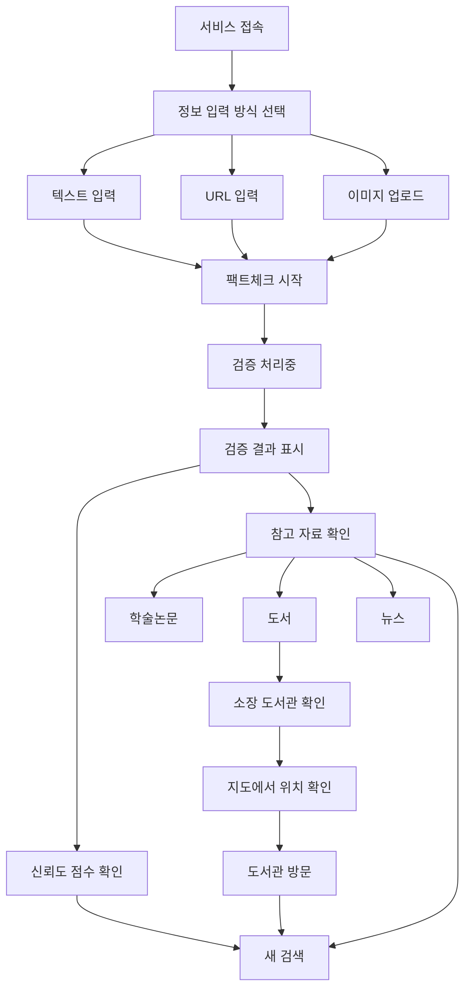
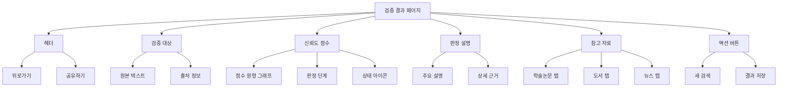
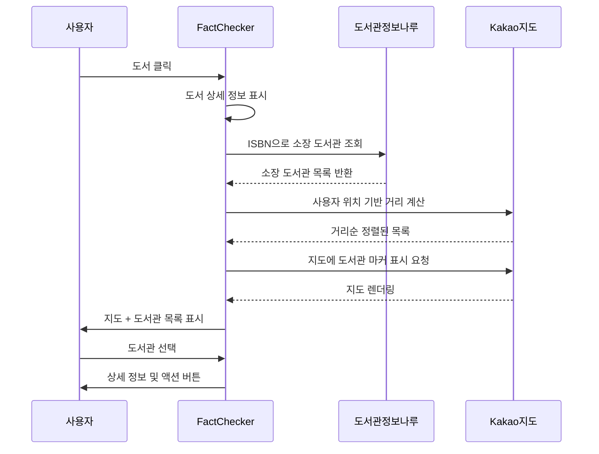
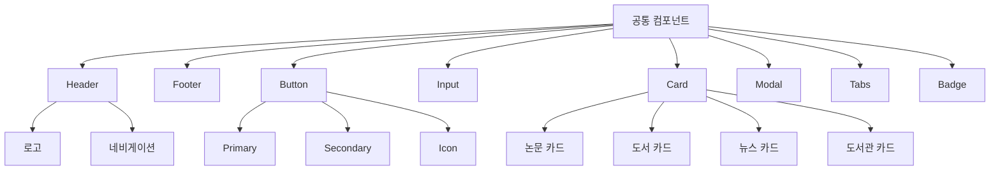
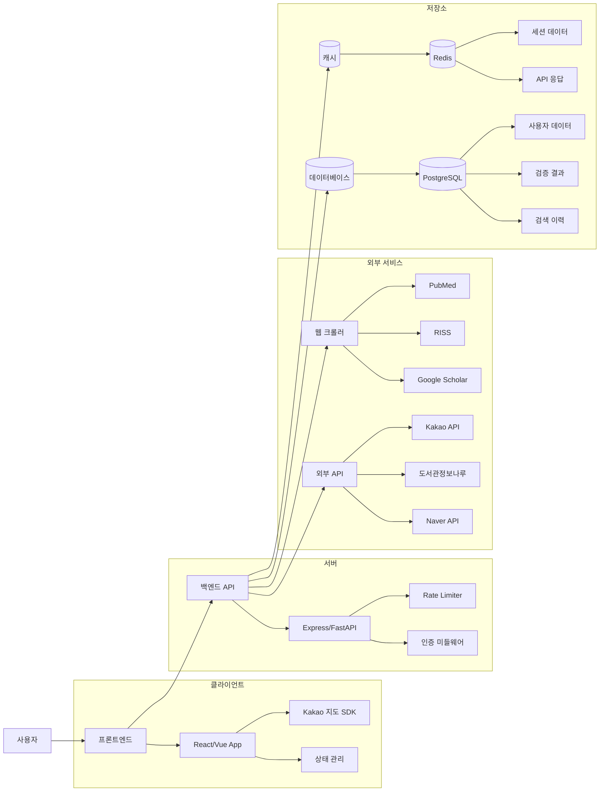
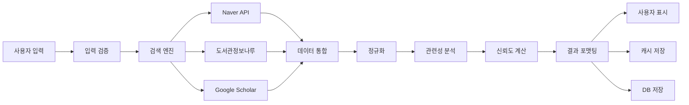

# FactChecker 와이어프레임

FactChecker 팩트체크 서비스의 UI/UX 설계 문서

---

## 📋 목차

1. [서비스 개요](#서비스-개요)
2. [사용자 흐름도](#사용자-흐름도)
3. [화면별 와이어프레임](#화면별-와이어프레임)
   - [메인 검색 화면](#1-메인-검색-화면)
   - [검증 결과 화면](#2-검증-결과-화면)
   - [참고 자료 화면](#3-참고-자료-화면)
   - [도서관 연계 화면](#4-도서관-연계-화면)
4. [컴포넌트 구조](#컴포넌트-구조)
5. [시스템 아키텍처](#시스템-아키텍처)
6. [반응형 디자인](#반응형-디자인)
7. [인터랙션 가이드](#인터랙션-가이드)

---

## 서비스 개요

### FactChecker란?

가짜뉴스와 허위정보를 학술자료 기반으로 검증하고, 도서관 이용을 활성화하는 팩트체크 서비스입니다.

### 핵심 차별화 기능

1. **다양한 입력 방식**: 텍스트, URL, 이미지 업로드
2. **다층적 판단**: 0-100점 신뢰도 점수 + 5단계 판정
3. **실물 자료 중심**: 학술논문, 도서, 신뢰할 수 있는 뉴스
4. **도서관 연계**: 소장 도서관 위치 안내 (핵심 차별점)

### 타겟 사용자

- 일반 대중 (모든 연령대)
- 1020세대 (유튜브·SNS 정보 검증)
- 직장인 (건강·육아·생활 정보)
- 학생·연구자 (과제·논문 자료)
- 시니어 (메신저 허위정보)

---

## 사용자 흐름도

전체 사용자 경험(UX) 흐름을 시각화한 다이어그램입니다.



### 사용자 여정 단계

1. **진입**: 서비스 접속 → 입력 방식 선택
2. **입력**: 텍스트/URL/이미지로 정보 입력
3. **검증**: 팩트체크 시작 → 자동 검증 처리
4. **결과**: 신뢰도 점수 및 판정 확인
5. **탐색**: 참고 자료(논문/도서/뉴스) 탐색
6. **연계**: 도서관 위치 확인 및 방문
7. **반복**: 새로운 검색 시작

---

## 화면별 와이어프레임

### 1. 메인 검색 화면

첫 진입 시 보이는 메인 화면으로, 사용자가 정보를 입력하는 화면입니다.

#### 데스크톱 레이아웃

```
┌────────────────────────────────────────────────────────────────┐
│                                                                  │
│                      🔍 FactChecker                              │
│              사실을 확인하고, 도서관과 연결하다                    │
│                                                                  │
├────────────────────────────────────────────────────────────────┤
│                                                                  │
│         [ 텍스트 입력 ]  [ URL 입력 ]  [ 이미지 업로드 ]         │
│                                                                  │
│  ┌──────────────────────────────────────────────────────────┐  │
│  │                                                            │  │
│  │   의심스러운 정보를 입력하세요...                            │
│  │                                                            │  │
│  │                                                            │  │
│  └──────────────────────────────────────────────────────────┘  │
│                                                                  │
│                      [ 팩트체크 시작 ]                           │
│                                                                  │
├────────────────────────────────────────────────────────────────┤
│  💡 예시:                                                        │
│  • "비타민 C를 매일 먹으면 감기를 완전히 예방할 수 있다"          │
│  • "양파를 방에 놓으면 독감 바이러스를 흡수한다"                 │
│  • "한국인의 평균 수면 시간이 세계 최하위"                       │
├────────────────────────────────────────────────────────────────┤
│  📌 최근 검색:                                                   │
│  • 비타민 C 감기 예방 (2분 전)                                   │
│  • 양파 독감 바이러스 (1시간 전)                                 │
│  • 수면 시간 통계 (어제)                                         │
└────────────────────────────────────────────────────────────────┘
```

#### 핵심 구성요소

**헤더 영역**
- 로고 및 서비스명: FactChecker
- 태그라인: "사실을 확인하고, 도서관과 연결하다"

**입력 방식 선택 탭**
- 텍스트 입력 (기본 활성)
- URL 입력
- 이미지 업로드

**검색 입력 영역**
- 멀티라인 텍스트 영역 (최대 500자)
- 플레이스홀더: "의심스러운 정보를 입력하세요..."
- 문자 수 카운터

**실행 버튼**
- "팩트체크 시작" 버튼 (Primary CTA)
- 입력이 없으면 비활성화

**예시 섹션**
- 사용자가 이해하기 쉽도록 3가지 예시 제공
- 클릭 시 자동 입력

**최근 검색 기록**
- 최근 3개 검색 기록 표시
- 시간 정보 포함
- 클릭 시 해당 결과로 이동

#### URL 입력 모드

```
┌────────────────────────────────────────────────────────────────┐
│         [ 텍스트 입력 ]  [✓ URL 입력 ]  [ 이미지 업로드 ]       │
│                                                                  │
│  ┌──────────────────────────────────────────────────────────┐  │
│  │ 🔗 https://example.com/news/article                       │  │
│  └──────────────────────────────────────────────────────────┘  │
│                                                                  │
│  ℹ️ 뉴스 기사나 블로그 URL을 입력하세요.                         │
│     주요 주장을 자동으로 추출하여 검증합니다.                     │
│                                                                  │
│                      [ URL 분석하기 ]                            │
└────────────────────────────────────────────────────────────────┘
```

#### 이미지 업로드 모드

```
┌────────────────────────────────────────────────────────────────┐
│         [ 텍스트 입력 ]  [ URL 입력 ]  [✓ 이미지 업로드 ]       │
│                                                                  │
│  ┌──────────────────────────────────────────────────────────┐  │
│  │                                                            │  │
│  │              📸                                            │  │
│  │                                                            │  │
│  │       이미지를 드래그하거나 클릭하여 업로드                  │
│  │                                                            │  │
│  │         [ 파일 선택 ]                                      │  │
│  │                                                            │  │
│  └──────────────────────────────────────────────────────────┘  │
│                                                                  │
│  ℹ️ 스크린샷, 문서 사진 등에서 텍스트를 자동 추출합니다.         │
│     JPG, PNG, PDF 형식 지원 (최대 10MB)                         │
└────────────────────────────────────────────────────────────────┘
```

---

### 2. 검증 결과 화면

팩트체크 결과를 보여주는 핵심 화면입니다.

#### 컴포넌트 구조도



#### 데스크톱 레이아웃

```
┌────────────────────────────────────────────────────────────────┐
│  ← 새 검색                                      [공유] [저장]    │
├────────────────────────────────────────────────────────────────┤
│                                                                  │
│  📝 검증 대상:                                                   │
│  "비타민 C를 매일 1000mg씩 먹으면 감기를 완전히 예방할 수 있다"   │
│                                                                  │
├────────────────────────────────────────────────────────────────┤
│                                                                  │
│                     ╭──────────╮                                │
│                     │          │                                │
│                     │    45    │      주의가 필요함              │
│                     │          │                                │
│                     ╰──────────╯            ⚠️                  │
│                                                                  │
│                    신뢰도 점수                                   │
│                                                                  │
├────────────────────────────────────────────────────────────────┤
│                                                                  │
│  🔍 판정 근거                                                    │
│                                                                  │
│  비타민 C가 감기를 '완전히 예방'한다는 주장은 과장되었습니다.     │
│                                                                  │
│  • 2013년과 2020년에 발표된 코크란 리뷰에 따르면, 비타민 C는     │
│    일반인에게 감기 예방 효과가 거의 없습니다.                     │
│                                                                  │
│  • 감기 증상의 지속 기간을 약간(약 8%) 단축시킬 수는 있지만       │
│    '완전한 예방'은 불가능합니다.                                 │
│                                                                  │
│  • 다만, 마라톤 선수나 고강도 운동을 하는 사람들에게는            │
│    일부 예방 효과가 관찰되었습니다.                               │
│                                                                  │
│  💡 권장사항: 일반적인 건강 유지를 위해서는 균형잡힌 식사가       │
│              과도한 비타민 보충제보다 효과적입니다.               │
│                                                                  │
├────────────────────────────────────────────────────────────────┤
│                                                                  │
│  📚 참고 자료                                                    │
│                                                                  │
│  [ 학술논문 3건 ]  [ 도서 5건 ]  [ 뉴스 2건 ]                   │
│                                                                  │
│  ───────────────────────────────────────────────────────────   │
│                                                                  │
│  학술논문                                                        │
│                                                                  │
│  1. 📄 Vitamin C for preventing and treating the common cold    │
│     Hemilä H, Chalker E                                         │
│     Cochrane Database of Systematic Reviews, 2013              │
│     🔗 DOI: 10.1002/14651858.CD000980.pub4                      │
│     관련성: ████████░░ 95%                                       │
│                                                                  │
│  2. 📄 Vitamin C supplementation and respiratory infections      │
│     ... (생략)                                                   │
│                                                                  │
│  [ 더보기 ]                                                      │
│                                                                  │
├────────────────────────────────────────────────────────────────┤
│                                                                  │
│              [ 새로운 검색하기 ]    [ 결과 공유하기 ]             │
│                                                                  │
└────────────────────────────────────────────────────────────────┘
```

#### 신뢰도 점수 시각화

**5단계 판정 시스템**

```
┌─────────────────────────────────────────────────────────┐
│  80-100점  │  ✓  │  사실로 확인됨        │  초록색   │
│  60-79점   │  ↗  │  대체로 사실임        │  연두색   │
│  40-59점   │  ⚠  │  주의가 필요함        │  노란색   │
│  20-39점   │  ?  │  근거 부족            │  주황색   │
│  0-19점    │  ✗  │  사실이 아님          │  빨간색   │
└─────────────────────────────────────────────────────────┘
```

#### 점수별 표시 예시

**사실로 확인됨 (90점)**

```
┌──────────────────────────────────┐
│                                    │
│        ╭──────────╮               │
│        │          │               │
│        │    90    │    ✓          │
│        │          │               │
│        ╰──────────╯               │
│                                    │
│      사실로 확인됨                 │
│                                    │
└──────────────────────────────────┘
```

**주의가 필요함 (45점)**

```
┌──────────────────────────────────┐
│                                    │
│        ╭──────────╮               │
│        │          │               │
│        │    45    │    ⚠️         │
│        │          │               │
│        ╰──────────╯               │
│                                    │
│      주의가 필요함                 │
│                                    │
└──────────────────────────────────┘
```

---

### 3. 참고 자료 화면

검증에 사용된 학술논문, 도서, 뉴스를 탭으로 구분하여 표시합니다.

#### 데스크톱 레이아웃

```
┌────────────────────────────────────────────────────────────────┐
│  📚 참고 자료                                                    │
├────────────────────────────────────────────────────────────────┤
│                                                                  │
│  [✓ 학술논문 3건 ]  [ 도서 5건 ]  [ 뉴스 2건 ]                  │
│                                                                  │
├────────────────────────────────────────────────────────────────┤
│                                                                  │
│  🔍 필터:  [ 최신순 ▼ ]  [ 관련성순 ]  [ 모든 분야 ▼ ]          │
│                                                                  │
├────────────────────────────────────────────────────────────────┤
│  ┌──────────────────────────────────────────────────────────┐  │
│  │  📄 1. Vitamin C for preventing and treating the common   │  │
│  │        cold: A meta-analysis                              │  │
│  │                                                            │  │
│  │     저자: Hemilä H, Chalker E                             │  │
│  │     출판: Cochrane Database of Systematic Reviews, 2013   │  │
│  │     분야: 의학, 영양학                                     │  │
│  │                                                            │  │
│  │     초록: 비타민 C의 감기 예방 및 치료 효과를 분석한        │  │
│  │           체계적 문헌고찰 및 메타분석 연구...              │  │
│  │                                                            │  │
│  │     관련성: ████████░░ 95%                                 │  │
│  │                                                            │  │
│  │     🔗 DOI: 10.1002/14651858.CD000980.pub4                │  │
│  │     [ 원문 보기 ]  [ 인용하기 ]                           │  │
│  └──────────────────────────────────────────────────────────┘  │
│                                                                  │
│  ┌──────────────────────────────────────────────────────────┐  │
│  │  📄 2. Vitamin C supplementation and respiratory           │  │
│  │        infections: a systematic review and meta-analysis  │  │
│  │                                                            │  │
│  │     저자: Johnston CS, Barkyoumb GM, Schumacher SS        │  │
│  │     출판: Nutrients, 2014                                 │  │
│  │     분야: 영양학, 면역학                                   │  │
│  │                                                            │  │
│  │     관련성: ███████░░░ 88%                                 │  │
│  │                                                            │  │
│  │     🔗 DOI: 10.3390/nu6031031                             │  │
│  │     [ 원문 보기 ]  [ 인용하기 ]                           │  │
│  └──────────────────────────────────────────────────────────┘  │
│                                                                  │
│  ┌──────────────────────────────────────────────────────────┐  │
│  │  📄 3. The role of vitamin C in immune function            │  │
│  │        ... (생략)                                          │  │
│  └──────────────────────────────────────────────────────────┘  │
│                                                                  │
└────────────────────────────────────────────────────────────────┘
```

#### 도서 탭

```
┌────────────────────────────────────────────────────────────────┐
│  📚 참고 자료                                                    │
├────────────────────────────────────────────────────────────────┤
│                                                                  │
│  [ 학술논문 3건 ]  [✓ 도서 5건 ]  [ 뉴스 2건 ]                  │
│                                                                  │
├────────────────────────────────────────────────────────────────┤
│  ┌──────────────────────────────────────────────────────────┐  │
│  │  📖 1. 비타민의 진실: 과학적 근거로 보는 영양소            │  │
│  │                                                            │  │
│  │     저자: 김영진                                           │  │
│  │     출판사: 사이언스북스                                   │  │
│  │     출판연도: 2022                                         │  │
│  │     ISBN: 978-89-XXXXX-XX-X                               │  │
│  │                                                            │  │
│  │     소개: 비타민의 효능과 부작용에 대한 과학적 사실을       │  │
│  │           객관적으로 설명한 건강 교양서...                 │  │
│  │                                                            │  │
│  │     관련성: ████████░░ 92%                                 │  │
│  │                                                            │  │
│  │     📍 소장 도서관: 전국 12개 도서관                       │  │
│  │                                                            │  │
│  │     [ 소장 도서관 보기 📍 ]  [ 알라딘 ]  [ 교보문고 ]      │  │
│  └──────────────────────────────────────────────────────────┘  │
│                                                                  │
│  ┌──────────────────────────────────────────────────────────┐  │
│  │  📖 2. 면역력을 높이는 비타민 가이드                       │  │
│  │                                                            │  │
│  │     저자: 이명진                                           │  │
│  │     출판사: 길벗                                           │  │
│  │     출판연도: 2021                                         │  │
│  │                                                            │  │
│  │     관련성: ███████░░░ 85%                                 │  │
│  │                                                            │  │
│  │     📍 소장 도서관: 전국 8개 도서관                        │  │
│  │                                                            │  │
│  │     [ 소장 도서관 보기 📍 ]  [ 알라딘 ]  [ 교보문고 ]      │  │
│  └──────────────────────────────────────────────────────────┘  │
│                                                                  │
│  ... (추가 도서)                                                │
│                                                                  │
└────────────────────────────────────────────────────────────────┘
```

#### 뉴스 탭

```
┌────────────────────────────────────────────────────────────────┐
│  📚 참고 자료                                                    │
├────────────────────────────────────────────────────────────────┤
│                                                                  │
│  [ 학술논문 3건 ]  [ 도서 5건 ]  [✓ 뉴스 2건 ]                  │
│                                                                  │
├────────────────────────────────────────────────────────────────┤
│  ┌──────────────────────────────────────────────────────────┐  │
│  │  📰 1. [팩트체크] 비타민 C, 감기 예방에 효과 있을까?        │  │
│  │                                                            │  │
│  │     언론사: 뉴스톱                                         │  │
│  │     게시일: 2023년 11월 15일                               │  │
│  │     분류: 건강, 팩트체크                                   │  │
│  │                                                            │  │
│  │     요약: 식품의약품안전처와 코크란 리뷰 자료를 바탕으로    │  │
│  │           비타민 C의 감기 예방 효과를 검증...              │  │
│  │                                                            │  │
│  │     판정: 대체로 사실 아님                                 │  │
│  │                                                            │  │
│  │     관련성: ████████░░ 90%                                 │  │
│  │                                                            │  │
│  │     🔗 [기사 원문 보기]                                    │  │
│  └──────────────────────────────────────────────────────────┘  │
│                                                                  │
│  ┌──────────────────────────────────────────────────────────┐  │
│  │  📰 2. 비타민 C 섭취와 감기 예방 관련 식약처 공식 입장     │  │
│  │                                                            │  │
│  │     출처: 식품의약품안전처 공식 블로그                     │  │
│  │     게시일: 2023년 10월 20일                               │  │
│  │                                                            │  │
│  │     관련성: ████████░░ 88%                                 │  │
│  │                                                            │  │
│  │     🔗 [공식 자료 보기]                                    │  │
│  └──────────────────────────────────────────────────────────┘  │
│                                                                  │
└────────────────────────────────────────────────────────────────┘
```

---

### 4. 도서관 연계 화면

**FactChecker의 핵심 차별화 기능**

도서를 클릭하면 나타나는 화면으로, 소장 도서관 정보를 지도와 함께 제공합니다.

#### 데이터 흐름도



#### 데스크톱 레이아웃

```
┌────────────────────────────────────────────────────────────────┐
│  ← 뒤로가기                                                      │
├────────────────────────────────────────────────────────────────┤
│                                                                  │
│  📖 비타민의 진실: 과학적 근거로 보는 영양소                     │
│                                                                  │
│  저자: 김영진                                                    │
│  출판사: 사이언스북스 | 출판연도: 2022                           │
│  ISBN: 978-89-XXXXX-XX-X                                        │
│  페이지: 352쪽                                                   │
│                                                                  │
│  ─────────────────────────────────────────────────────────     │
│                                                                  │
│  💡 책 소개                                                      │
│  비타민의 효능과 부작용에 대한 과학적 사실을 객관적으로          │
│  설명한 건강 교양서. 학술 연구와 임상 데이터를 바탕으로...       │
│                                                                  │
├────────────────────────────────────────────────────────────────┤
│                                                                  │
│  🗺️ 소장 도서관 위치                                             │
│                                                                  │
│  ┌──────────────────────────────────────────────────────────┐  │
│  │                                                            │  │
│  │              [ Kakao 지도 표시 영역 ]                      │  │
│  │                                                            │  │
│  │  📍 내 위치 (서울시 강남구)                                │  │
│  │                                                            │  │
│  │  📚 국립중앙도서관 (2.3km) - 마커                          │  │
│  │  📚 서울시립도서관 (3.7km) - 마커                          │  │
│  │  📚 강남구립도서관 (1.8km) - 마커                          │  │
│  │  ... (기타 도서관 마커들)                                  │  │
│  │                                                            │  │
│  │  [ 현재 위치로 ]  [ 확대 + ]  [ 축소 - ]                  │  │
│  │                                                            │  │
│  └──────────────────────────────────────────────────────────┘  │
│                                                                  │
├────────────────────────────────────────────────────────────────┤
│                                                                  │
│  📍 소장 도서관 목록 (거리순)                  전국 12개 도서관  │
│                                                                  │
│  ┌──────────────────────────────────────────────────────────┐  │
│  │  📚 강남구립도서관                           1.8 km         │  │
│  │                                                            │  │
│  │     대출 가능 ✅                                            │  │
│  │     서울특별시 강남구 개포로 613                            │  │
│  │     운영시간: 09:00 - 22:00 (월요일 휴관)                  │  │
│  │     전화: 02-3444-8900                                     │  │
│  │                                                            │  │
│  │     [ 🚗 길찾기 ]  [ 📞 전화하기 ]  [ 🌐 홈페이지 ]         │  │
│  │                                                            │  │
│  └──────────────────────────────────────────────────────────┘  │
│                                                                  │
│  ┌──────────────────────────────────────────────────────────┐  │
│  │  📚 국립중앙도서관                           2.3 km         │  │
│  │                                                            │  │
│  │     대출 가능 ✅                                            │  │
│  │     서울특별시 서초구 반포대로 201                          │  │
│  │     운영시간: 09:00 - 18:00 (일요일, 공휴일 휴관)          │  │
│  │     전화: 02-590-0799                                      │  │
│  │                                                            │  │
│  │     [ 🚗 길찾기 ]  [ 📞 전화하기 ]  [ 🌐 홈페이지 ]         │  │
│  │                                                            │  │
│  └──────────────────────────────────────────────────────────┘  │
│                                                                  │
│  ┌──────────────────────────────────────────────────────────┐  │
│  │  📚 서울시립도서관                           3.7 km         │  │
│  │                                                            │  │
│  │     대출 중 ⏳ (반납 예정일: 2026-01-28)                    │  │
│  │     서울특별시 종로구 사직로 110                            │  │
│  │     운영시간: 09:00 - 21:00 (월요일 휴관)                  │  │
│  │     전화: 02-2133-0300                                     │  │
│  │                                                            │  │
│  │     [ 🚗 길찾기 ]  [ 📞 전화하기 ]  [ 🌐 홈페이지 ]         │  │
│  │     [ 📅 예약하기 ]                                         │  │
│  │                                                            │  │
│  └──────────────────────────────────────────────────────────┘  │
│                                                                  │
│  ... (추가 도서관)                                              │
│                                                                  │
│  [ 더보기 ▼ ]                                                   │
│                                                                  │
├────────────────────────────────────────────────────────────────┤
│                                                                  │
│  🛒 온라인 구매                                                  │
│                                                                  │
│  [ 알라딘 ]  [ 교보문고 ]  [ YES24 ]                            │
│                                                                  │
└────────────────────────────────────────────────────────────────┘
```

#### 대출 상태 표시

```
┌─────────────────────────────────────────┐
│  대출 가능 ✅                            │
│  지금 바로 방문하여 대출하실 수 있습니다 │
└─────────────────────────────────────────┘

┌─────────────────────────────────────────┐
│  대출 중 ⏳                               │
│  반납 예정일: 2026-01-28                 │
│  [ 예약하기 ] 버튼 표시                  │
└─────────────────────────────────────────┘

┌─────────────────────────────────────────┐
│  정리 중 📦                               │
│  현재 서가 정리 중입니다                 │
└─────────────────────────────────────────┘

┌─────────────────────────────────────────┐
│  소장 없음 ❌                             │
│  해당 도서관에는 소장되어 있지 않습니다  │
└─────────────────────────────────────────┘
```

---

## 컴포넌트 구조

재사용 가능한 UI 컴포넌트 정의

### 공통 컴포넌트



### 페이지별 컴포넌트

**메인 페이지**
- SearchInput: 검색 입력 컴포넌트
- InputModeTabs: 입력 방식 탭
- ExampleList: 예시 목록
- RecentSearches: 최근 검색

**결과 페이지**
- ScoreCircle: 신뢰도 점수 원형 그래프
- VerificationLevel: 판정 단계 표시
- ExplanationBox: 판정 설명 박스
- SourceTabs: 참고 자료 탭

**도서관 페이지**
- LibraryMap: Kakao 지도 컴포넌트
- LibraryList: 도서관 목록
- LibraryCard: 개별 도서관 카드
- AvailabilityBadge: 대출 상태 뱃지

---

## 시스템 아키텍처

전체 시스템의 구조를 시각화한 다이어그램입니다.



### 데이터 흐름



---

## 반응형 디자인

다양한 디바이스에서의 최적화된 레이아웃

### 브레이크포인트

```
┌────────────────────────────────────┐
│  모바일:    320px - 767px          │
│  태블릿:    768px - 1023px         │
│  데스크톱:  1024px - 1439px        │
│  와이드:    1440px 이상            │
└────────────────────────────────────┘
```

### 모바일 레이아웃 (320px - 767px)

#### 메인 화면 (모바일)

```
┌─────────────────────────┐
│  ☰  FactChecker         │
├─────────────────────────┤
│                         │
│  [텍스트][URL][이미지]  │
│                         │
│  ┌───────────────────┐  │
│  │                   │  │
│  │  검증할 정보...   │  │
│  │                   │  │
│  └───────────────────┘  │
│                         │
│   [팩트체크 시작]       │
│                         │
├─────────────────────────┤
│  💡 예시                │
│  • 비타민 C 감기...     │
├─────────────────────────┤
│  📌 최근 검색           │
│  • 항목 1               │
│  • 항목 2               │
└─────────────────────────┘
```

#### 검증 결과 (모바일)

```
┌─────────────────────────┐
│  ← 새 검색       [공유] │
├─────────────────────────┤
│  📝 검증 대상:          │
│  "비타민 C를 매일..."   │
├─────────────────────────┤
│                         │
│      ╭──────╮           │
│      │  45  │           │
│      ╰──────╯           │
│                         │
│   주의가 필요함 ⚠️       │
│                         │
├─────────────────────────┤
│  🔍 판정 근거           │
│                         │
│  비타민 C가 감기를...   │
│  (설명 내용)            │
│                         │
├─────────────────────────┤
│  📚 참고 자료           │
│                         │
│  [논문 3][도서 5][뉴스2]│
│                         │
│  논문 제목 1            │
│  저자, 연도             │
│  ───────────────────    │
│  논문 제목 2            │
│  ...                    │
└─────────────────────────┘
```

#### 도서관 연계 (모바일)

```
┌─────────────────────────┐
│  ← 뒤로가기             │
├─────────────────────────┤
│  📖 비타민의 진실       │
│  김영진 | 2022          │
├─────────────────────────┤
│  ┌───────────────────┐  │
│  │                   │  │
│  │  [ 지도 영역 ]    │  │
│  │                   │  │
│  └───────────────────┘  │
├─────────────────────────┤
│  📍 소장 도서관 (12개)  │
│                         │
│  ┌───────────────────┐  │
│  │ 📚 강남구립도서관 │  │
│  │    1.8km          │  │
│  │    대출 가능 ✅    │  │
│  │    [길찾기][전화] │  │
│  └───────────────────┘  │
│                         │
│  ┌───────────────────┐  │
│  │ 📚 국립중앙도서관 │  │
│  │    2.3km          │  │
│  │    대출 가능 ✅    │  │
│  └───────────────────┘  │
│                         │
│  [ 더보기 ]             │
└─────────────────────────┘
```

### 태블릿 레이아웃 (768px - 1023px)

태블릿에서는 2단 레이아웃을 활용합니다.

```
┌─────────────────────────────────────────────┐
│  FactChecker                        [메뉴]  │
├─────────────────────────────────────────────┤
│                                             │
│  [텍스트 입력] [URL 입력] [이미지 업로드]   │
│                                             │
│  ┌───────────────────────────────────────┐  │
│  │  검색 입력 영역                       │  │
│  └───────────────────────────────────────┘  │
│                                             │
│              [팩트체크 시작]                │
│                                             │
├──────────────────────┬──────────────────────┤
│  💡 예시              │  📌 최근 검색        │
│  • 예시 1            │  • 검색 1            │
│  • 예시 2            │  • 검색 2            │
│  • 예시 3            │  • 검색 3            │
└──────────────────────┴──────────────────────┘
```

### 반응형 규칙

**글자 크기**
- 모바일: 14px - 16px (본문)
- 태블릿: 15px - 17px
- 데스크톱: 16px - 18px

**여백**
- 모바일: 16px
- 태블릿: 24px
- 데스크톱: 32px

**컨테이너 최대 너비**
- 모바일: 100% (16px 좌우 여백)
- 태블릿: 100% (24px 좌우 여백)
- 데스크톱: 1200px (중앙 정렬)

**컴포넌트 배치**
- 모바일: 1단 (세로 스택)
- 태블릿: 2단 (필요시)
- 데스크톱: 2-3단 (여유 공간 활용)

---

## 인터랙션 가이드

사용자 액션에 대한 시스템 반응

### 입력 단계

**텍스트 입력 시**
1. 사용자가 입력창 클릭 → 포커스 효과 (파란색 테두리)
2. 텍스트 입력 중 → 실시간 문자 수 카운터 업데이트
3. 500자 초과 시 → 경고 메시지 표시
4. 입력 완료 → "팩트체크 시작" 버튼 활성화

**URL 입력 시**
1. URL 탭 클릭 → 입력 모드 전환
2. URL 붙여넣기 → 자동 형식 검증
3. 유효하지 않은 URL → 오류 메시지 표시
4. 유효한 URL → "URL 분석하기" 버튼 활성화

**이미지 업로드 시**
1. 드래그 앤 드롭 영역 → 호버 시 색상 변경
2. 이미지 드롭 → 업로드 진행 표시
3. OCR 처리 중 → 로딩 애니메이션
4. 텍스트 추출 완료 → 추출된 텍스트 표시

### 검색 단계

**팩트체크 시작 버튼 클릭**

```
[팩트체크 시작] 클릭
    ↓
[로딩 화면]
┌─────────────────────────┐
│                         │
│    🔍                   │
│                         │
│  정보를 검증하고 있습니다│
│                         │
│  • 학술논문 검색 중...  │
│  • 도서 정보 수집 중... │
│  • 뉴스 검색 중...      │
│                         │
│  ████████░░ 80%         │
│                         │
└─────────────────────────┘
    ↓
[결과 화면 전환]
(0.5초 페이드 인 효과)
```

### 결과 확인 단계

**점수 애니메이션**
- 결과 화면 진입 시 점수가 0에서 실제 점수까지 카운트업
- 소요 시간: 1초
- Easing: ease-out

**참고 자료 탭 전환**
- 탭 클릭 시 부드러운 전환 (0.3초)
- 활성 탭: 언더라인 표시
- 내용: 페이드 인/아웃 효과

**도서 카드 클릭**
- 호버 시: 그림자 효과 증가
- 클릭 시: 0.3초 후 도서관 연계 화면으로 전환
- 뒤로가기: 이전 스크롤 위치 기억

### 도서관 연계 단계

**지도 인터랙션**
- 페이지 로드 시: 사용자 위치로 중심 이동
- 도서관 마커 클릭 → 해당 도서관 카드로 스크롤
- 지도 확대/축소 → 마커 클러스터링 자동 조정

**도서관 카드 액션**
- 길찾기 버튼 → Kakao 내비게이션 앱 실행
- 전화하기 버튼 → 전화 앱 실행
- 홈페이지 버튼 → 새 탭에서 도서관 홈페이지 오픈
- 예약하기 버튼 → 예약 모달 표시

### 에러 처리

**네트워크 오류**

```
┌─────────────────────────┐
│  ⚠️ 연결 오류            │
│                         │
│  네트워크 연결을 확인해 │
│  주세요.                │
│                         │
│  [ 다시 시도 ]          │
└─────────────────────────┘
```

**검색 결과 없음**

```
┌─────────────────────────┐
│  🔍 검색 결과 없음       │
│                         │
│  관련된 자료를 찾지     │
│  못했습니다.            │
│                         │
│  • 다른 키워드로 검색   │
│  • 검색어를 간단히 입력 │
│                         │
│  [ 새로 검색하기 ]      │
└─────────────────────────┘
```

**API 제한 초과**

```
┌─────────────────────────┐
│  ⏱️ 잠시 기다려주세요    │
│                         │
│  일일 검색 제한에       │
│  도달했습니다.          │
│                         │
│  다음 검색 가능:        │
│  23시간 45분 후         │
│                         │
│  [ 확인 ]               │
└─────────────────────────┘
```

### 로딩 상태

**스켈레톤 UI**

결과를 기다리는 동안 스켈레톤 UI로 레이아웃 구조를 미리 보여줍니다.

```
┌─────────────────────────┐
│  ████░░░░░░░░░░░░░░░    │  ← 제목
│                         │
│  ▓▓▓▓░░░░░░░░░░░        │  ← 설명
│  ▓▓▓▓░░░░░░░░░░░        │
│                         │
│  ████░░░░░ ████░░░░░    │  ← 버튼
└─────────────────────────┘
```

### 피드백 메시지

**성공**
- 녹색 배경, 체크 아이콘
- 2초 후 자동 사라짐

**경고**
- 노란색 배경, 느낌표 아이콘
- 사용자가 닫기 전까지 유지

**오류**
- 빨간색 배경, X 아이콘
- 사용자가 닫기 전까지 유지

---

## 접근성 (Accessibility)

### WCAG 2.1 준수

**키보드 네비게이션**
- Tab: 다음 요소로 이동
- Shift + Tab: 이전 요소로 이동
- Enter/Space: 버튼 실행
- Esc: 모달 닫기

**스크린 리더 지원**
- alt 텍스트: 모든 이미지에 대체 텍스트 제공
- aria-label: 아이콘 버튼에 레이블 제공
- role 속성: 적절한 역할 명시

**색상 대비**
- 텍스트/배경 대비율: 최소 4.5:1
- 큰 텍스트: 최소 3:1
- 색각 이상자를 위한 색상 선택

**포커스 표시**
- 모든 인터랙티브 요소에 명확한 포커스 표시
- 포커스 순서: 논리적 흐름 유지

---

## 디자인 토큰

### 색상 팔레트

**Primary (메인)**
- Primary-900: #1e3a8a (진한 파란색)
- Primary-700: #1d4ed8
- Primary-500: #3b82f6 (기본)
- Primary-300: #93c5fd
- Primary-100: #dbeafe

**판정 상태별**
- Success (사실): #22c55e (녹색)
- Warning (주의): #eab308 (노란색)
- Danger (거짓): #ef4444 (빨간색)
- Info (정보): #3b82f6 (파란색)
- Neutral (중립): #6b7280 (회색)

**배경 및 텍스트**
- Background: #ffffff
- Surface: #f9fafb
- Text-Primary: #111827
- Text-Secondary: #6b7280
- Border: #e5e7eb

### 타이포그래피

**폰트 패밀리**
- 한글: Pretendard, 맑은 고딕, sans-serif
- 영문: Inter, Arial, sans-serif
- 숫자: Roboto Mono (점수 표시용)

**폰트 크기**
- Heading 1: 32px / 2rem
- Heading 2: 24px / 1.5rem
- Heading 3: 20px / 1.25rem
- Body: 16px / 1rem
- Small: 14px / 0.875rem
- Caption: 12px / 0.75rem

**폰트 굵기**
- Regular: 400
- Medium: 500
- SemiBold: 600
- Bold: 700

### 간격 (Spacing)

```
4px   (0.25rem) - xs
8px   (0.5rem)  - sm
16px  (1rem)    - md
24px  (1.5rem)  - lg
32px  (2rem)    - xl
48px  (3rem)    - 2xl
64px  (4rem)    - 3xl
```

### 그림자 (Shadow)

```
shadow-sm:  0 1px 2px rgba(0,0,0,0.05)
shadow:     0 1px 3px rgba(0,0,0,0.1)
shadow-md:  0 4px 6px rgba(0,0,0,0.1)
shadow-lg:  0 10px 15px rgba(0,0,0,0.1)
shadow-xl:  0 20px 25px rgba(0,0,0,0.1)
```

### 모서리 (Border Radius)

```
rounded-sm:   4px
rounded:      6px
rounded-md:   8px
rounded-lg:   12px
rounded-xl:   16px
rounded-full: 9999px
```

---

## 개발 가이드

### 프론트엔드 구현 순서

1. **공통 컴포넌트 개발** (1주)
   - Button, Input, Card, Modal
   - Header, Footer, Navigation

2. **메인 페이지** (3일)
   - SearchInput 컴포넌트
   - 입력 모드 전환 로직
   - 최근 검색 기록

3. **결과 페이지** (5일)
   - 점수 표시 컴포넌트
   - 참고 자료 탭
   - 애니메이션 효과

4. **도서관 페이지** (5일)
   - Kakao 지도 통합
   - 도서관 목록
   - 거리 계산 로직

5. **반응형 대응** (3일)
   - 모바일 레이아웃
   - 태블릿 레이아웃
   - 테스트 및 조정

### 백엔드 API 엔드포인트

```
POST   /api/verify          - 팩트체크 실행
GET    /api/papers/:id      - 논문 상세 정보
GET    /api/books/:isbn     - 도서 상세 정보
GET    /api/libraries       - 소장 도서관 조회
GET    /api/history         - 검색 이력 조회
POST   /api/save            - 결과 저장
```

---

## 다음 단계

### 후속 문서

1. **디자인 가이드** - 브랜딩, 로고, 컬러 시스템
2. **기술 문서** - 시스템 아키텍처, 기술 스택
3. **API 명세서** - 백엔드 API 상세 문서
4. **개발 가이드** - 코딩 컨벤션, Git 워크플로우

### MVP 개발 시작

이제 와이어프레임을 기반으로 실제 개발을 시작할 수 있습니다.

**즉시 시작 가능한 작업:**
1. React/Vue 프로젝트 초기화
2. 공통 컴포넌트 라이브러리 구축
3. Kakao 지도 SDK 설정
4. API 통합 (Naver, 도서관정보나루)

---

**문서 버전**: 1.0  
**작성일**: 2026년 1월 22일  
**작성자**: FactChecker 팀  
**상태**: 초안 완료

**관련 문서:**
- [서비스 기획안](proposal.md)
- [구현 로드맵](IMPLEMENTATION-ROADMAP.md)
- [README](../README.md)
